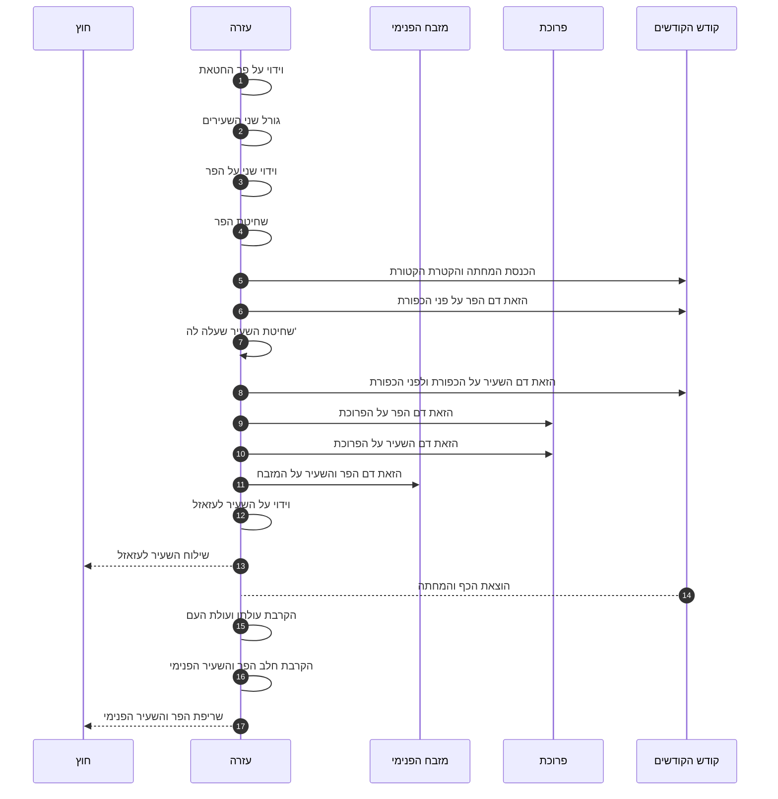

# מיקומי עבודת הכוהן הגדול ביום הכיפורים
[[HOME]]/[[Tasks]]

> לצורך הבנת הגמרא במסכת יומא דף מ'
     
     

```mermaid
sequenceDiagram
autonumber
     participant חוץ 
     participant עזרה
     participant מזבח הפנימי
     participant פרוכת 
     participant קודש הקודשים
    עזרה -> עזרה : וידוי על פר החטאת
    עזרה -> עזרה : גורל שני השעירים 
    עזרה -> עזרה : וידוי שני על הפר 
    עזרה -> עזרה : שחיטת הפר 
    עזרה ->> קודש הקודשים: הכנסת המחתה והקטרת הקטורת 
    עזרה ->> קודש הקודשים: הזאת דם הפר על פני הכפורת
    עזרה ->> עזרה: שחיטת השעיר שעלה לה'
    עזרה ->> קודש הקודשים: הזאת דם השעיר על הכפורת ולפני הכפורת
    עזרה ->> פרוכת: הזאת דם הפר על הפרוכת
    עזרה->> פרוכת: הזאת דם השעיר על הפרוכת
    עזרה ->> מזבח הפנימי: הזאת דם הפר והשעיר על המזבח
    עזרה -> עזרה : וידוי על השעיר לעזאזל 
    עזרה -->> חוץ : שילוח השעיר לעזאזל
    קודש הקודשים --> עזרה : הוצאת הכף והמחתה
    עזרה -> עזרה: הקרבת עולתו ועולת העם
    עזרה -> עזרה : הקרבת חלב הפר והשעיר הפנימי
    עזרה -->> חוץ : שריפת הפר והשעיר הפנימי
```