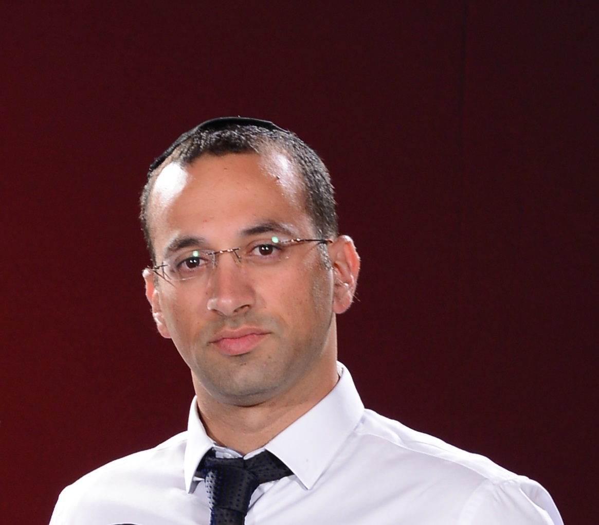

# Home

Hey, This is my home.
Contents:
> ##### [[Professional | ידע מקצועי וכללי]]
> ##### [[Open University | OP - האוניברסיטה הפתוחה]]
> ##### [[Tasks| שולחן עבודה - משימות]]
> ##### [[Personal | אישי]]

## Tools
>#####  [Markdown RTL Editor](http://10.147.15.78:8080/rtlmd)
> ##### [AOP Server](http://10.147.15.78:8010)
> ##### [Swagger](http://10.147.15.78:8080/swagger/dist)
> ##### [Swagger-Editor](http://10.147.15.78:8080/swagger-editor)
> ##### WSO2 - API Management
>1.	ה-carbon בכתובת https://localhost:9443/carbon
>2.	ה-dev-portal בכתובת https://localhost:9443/devportal
>3.	ה-publisher בכתובת https://localhost:9443/publisher
>4.	ה-api-gw עצמו, בכתובת https://localhost:8243/….  (בכתובת הזו חושפים API לאפליקציות).

## Markdowns
#### [Oracle Rest and OAuth2](http://10.147.15.78:8080/My/WebServiceTEST.html)
## Specs
####  [הערכת ספקים: תוכנית איסוף מידע תזכורות](http://10.147.15.78:8080/My/QmaneagmentV1.html)
#### [הערכת ספקים: תוכנית שליחת המיילים ועדכוני סטטוס](http://10.147.15.78:8080/My/handlingmails.html) 
