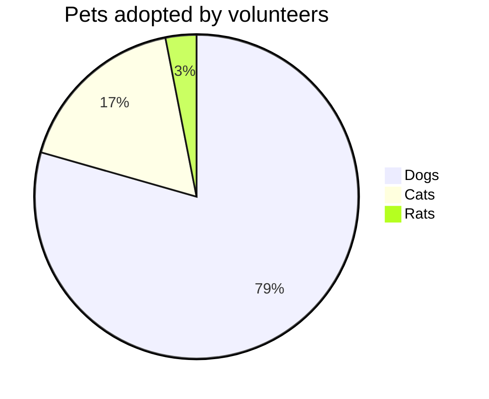
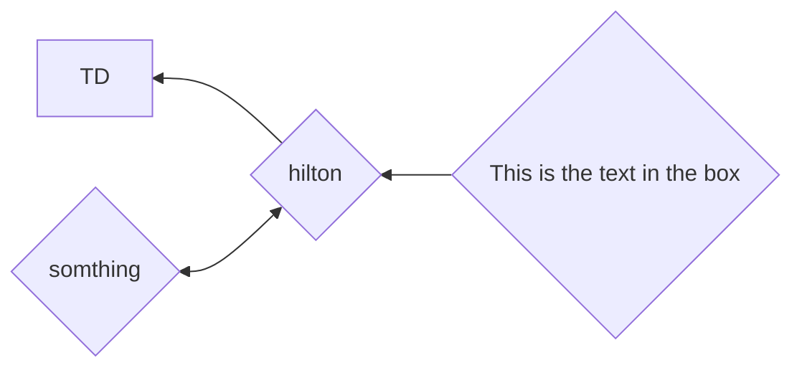

## [[Install Scoop]]
A tool for pckage installation
## [[Install helm]]
Helm is a package manager for Kubernetes that allows developers
and operators to more easily package, configure, and deploy
applications and services onto Kubernetes clusters

