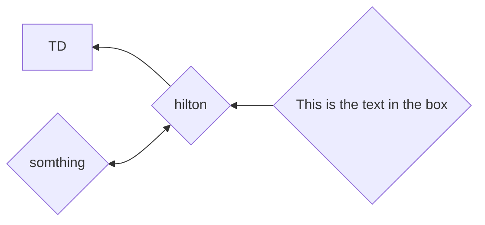
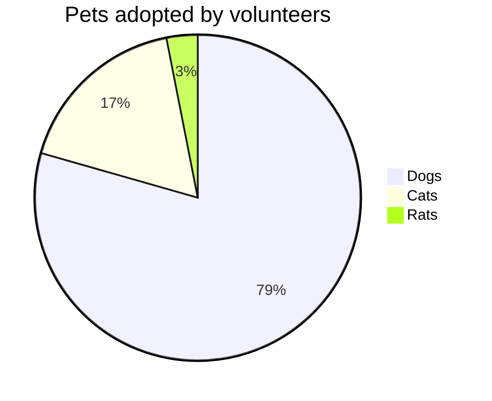
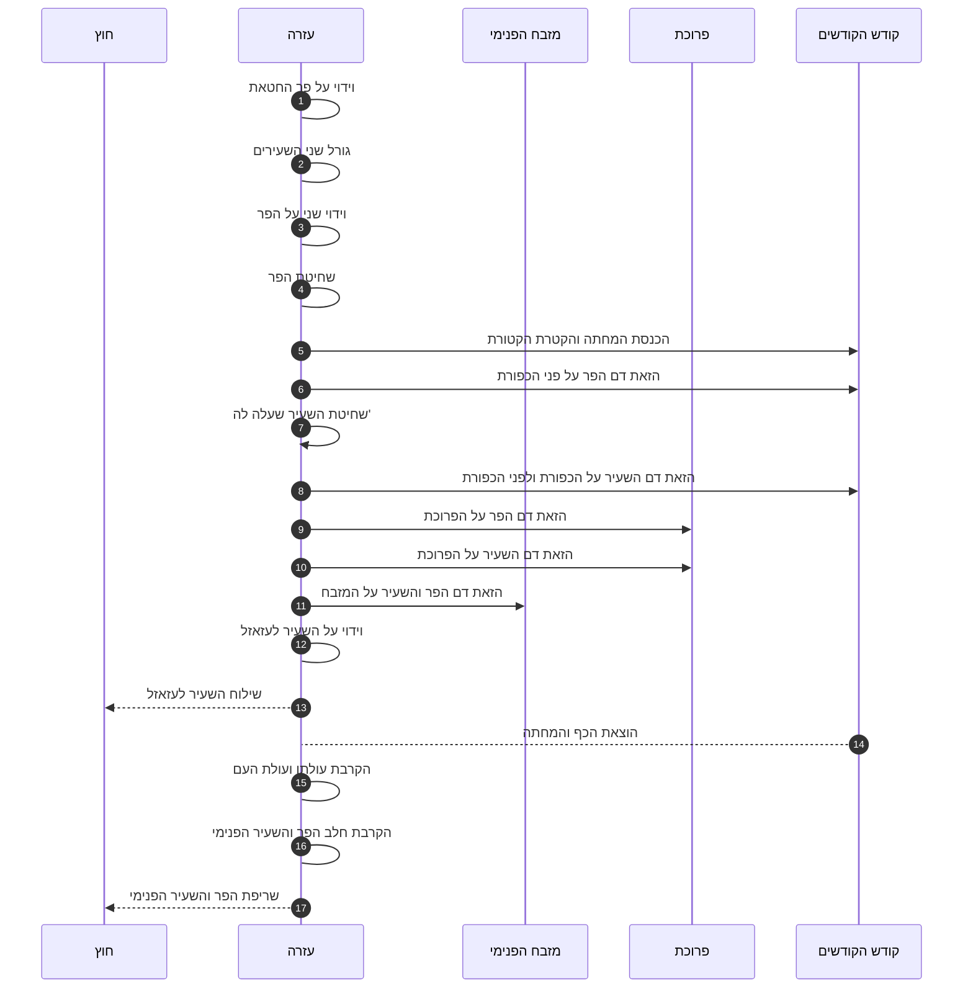
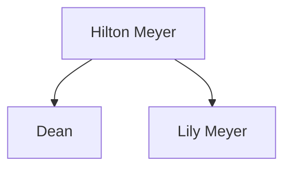

[[2021-05-23]]
# Mermaid
[[index]]/ [[Professional]]

## Examples

## pie

## Sequence

          
## Internal link

## More about Mermaid: 
[mermaid - Markdownish syntax for generating flowcharts, sequence diagrams, class diagrams, gantt charts and git graphs. (mermaid-js.github.io)](https://mermaid-js.github.io/mermaid/#/)
#documents #mermaid 