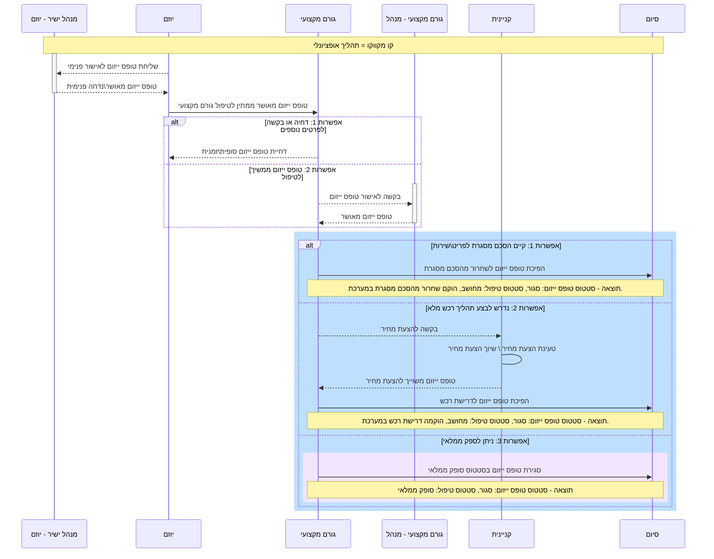

\

	
[[2021-05-19]]
# חידוש מערכת טופס ייזום
[[index]]/[[Open University]]/[[ERP]]/[[טופס ייזום]]
[[index]]/[[Open University]]/[[APEX]]/[[טופס ייזום]]
	
	
	

המערכת תיבנה על פלטפורמת APEX שמאפשרת יצירה והקמת אפליקציות מבוססות WEB תוך הישענות על בסיס הנתונים של ה-ERP.

באפליקציות שנבנות בפלטפורמת APEX, ניתן להקים אפליקציות המבוססות על הזדהות שם משתמש וסיסמת רשת על אף היותן יושבות על בסיס הנתונים של ה-ERP.

בנוסף, תחזוקת האפליקציות והוספת פיצ'רים הינה קלה וזמינה יותר מהטכנולוגיה הנוכחית

המערכת תיבנה, כאמור, על מסד הנתונים האפליקטיבי אבל פעילותה תנוהל בטבלאות זרות למערכת הERP.

עם זאת, יהיו כמה ממשקים עם המערכת:

· מנגנון הפיכת ייזום לדרישה: בגמר הטיפול במסמך הייזום, יוכל הגורם המקצועי המורשה לעניין זה, לבצע הפיכה של מסמך הייזום לדרישת רכש תוך שימוש בטבלאות הInterface האפליקטיביות וכן בפרוצדורות API ייעודיות לכך.

· מנגנון הפיכת ייזום להצעת מחיר (Quotation): יתאפשר לקניין לבצע הזנת הצעת מחיר דרך מנגנון מערכת כבסעיף הקודם, לשם יצירת הצעת מחיר שאותה יהפוך הגורם המקצועי לדרישה.

· הפניה חוזרת מדרישה ליזום: באם נוצרה דרישה בעקבות ייזום, יתאפשר לגשת למסמך הייזום בהפניה מהירה למערכת הייזומים (מה שכיום אינו אפשרי).

### 4.3.1 אופי המערכת וסוגה

### המערכת הינה חידוש ויישום מחדש של מערכת קיימת הדבר יתבטא:

### · בשינוי מבני הנתונים

· בשיפור פונקציונאליות קיימת ובהוספת פונקציות חדשות.

· בשיפור בחווית המשתמש.

· בשיפור בממשק המשתמש.

· בצמצום מעורבות מנהלי המערכת בניהול הרשאות המשתמשים.

· בהגדלת שקיפות תהליך הרכש ליוזמים.

· בהנגשת המערכת לבעלי מוגבלויות.

· בשיפור אבטחת המידע.

### 4.3.2 אילוצים

כאמור לעייל, אחד הטריגרים לחידוש המערכת הינו אילוץ הנגישות. ע"פ חוק, נדרש שכלל הטפסים הממוחשבים בארגון, כמו גם מערכות המידע במדת האפשר, יהיו מונגשים לבעלי לקויות ראיה.

על הדף להיות קריא ותגובתי לכלים המאפשרים את גישת בעלי המוגבלויות ואת תפקודם המיטבי במערכת.

### 4.4.1 תרשים UseCase1

1. יוזם: כל משתמש במערכת שנמצא בסבב אישורים הנקרא "ייזומי רכש"
2. מאשר בקשה מחלקתית: משתמש שהוגדר כמאשר, יוכל לאשר בקשות עבור המחלקה תקציבית שהוא שוייך אליה כמאשר.
3.  גורם מקצועי: משתמש ששוייך לקבוצת תתי החשבון (או לשם מחלקת הגורם המקצועי במדה ומדובר בבקשה שלא הפכה לדרישת רכש עדיין) של הבקשה.
4. גורם מקצועי מאשר: כל משתמש מסעיף 3 שהוגדר גם כמאשר בקשות סופי.
5. קניין: משתמש שהוגדר במערכת ה-ERP כקניין מקים הזמנות (PO\_AGENTS.ATTRIBUTE1 = 'Y')
6. מנהל מערכת: משתמש שיוגדר כמנהל מערכת יוכל לבצע את כל הפעולות במערכת.

## 4.6 מבנה נתונים כללי – טופס ייזום

בשלב הראשון, המשתמש יבחר את הגורם המקצועי אליו הייזום מיועד ושאליו הייזום יישלח

האפשרויות תהיינה:

1. גורם מקצועי: השדה יכיל רשימת ערכים שתכיל את שמות המחלקה ותחזיר את קוד המחלקה.

2. חיפוש לפי פריט אב: השדה יכיל ר"ע שתציג את הפריטים\\שירותים ותחזיר את קוד המחלקה שאליה הפריט משוייך. (מדובר בטבלאות

בשלב השני, המשתמש יזין את הפרטים בטופס הייזום.

מבנה הנתונים של הטופס יוקבל למבנה של דרישות הרכש. כלומר יהיו שלש רמות נתונים:

\- נתוני כותרת

יכילו נתונים שאינם משתנים בכפוף לפריט\\שירות המוזמנים. נתונים לדוגמא: שם מכין הייזום, מספר הייזום, שם מנהל מאשר וכו'

\- נתוני שורה

יכילו נתונים שקשורים לפריט\\שירות המבוקש. נתונים לדוגמא: תיאור השירות\\פריט, מיקום למשלוח, תאריך מבוקש, קבצים מצורפים וכו'.

\- נתונים תקציביים

זאת תהיה רמת נתונים שכברירת מחדל, תהיה אפשרית להזנה, אך לא תהיה חובה. מאחר ונתונים תקציביים אינם ידועים לכל מזיני הייזום.

### 4.7.1 נתוני כותרת להזנה

18/01/2021 – לאור הפיתוחים המקבילים שבוצעו במערכת, ניתן להשתמש בטבלאות שנוצרו לצורך שליחה לAPI  של הקמת הדרישות. ולהתעלם מהסעיף הבא.

\- מספר ייזום – ID\_INITIATING: מספור אוטומטי.

\- סטטוס: שדה מחושב

\- פרטי היוזם: ראה שליפת נתונים: [לינק](file:///S:/erp$/Management/Customizations/13025%20-%D7%97%D7%99%D7%93%D7%95%D7%A9%20%D7%9E%D7%A2%D7%A8%D7%9B%D7%AA%20%D7%98%D7%95%D7%A4%D7%A1%20%D7%99%D7%99%D7%96%D7%95%D7%9D/%D7%97%D7%99%D7%93%D7%95%D7%A9%20%D7%9E%D7%A2%D7%A8%D7%9B%D7%AA%20%D7%98%D7%95%D7%A4%D7%A1%20%D7%99%D7%99%D7%96%D7%95%D7%9D%202.htm#_%D7%A4%D7%A8%D7%98%D7%99_%D7%94%D7%99%D7%95%D7%96%D7%9D_%E2%80%93)

\- מופנה אל גורם מקצועי (תחום): רשימת ערכים : [לינק](file:///S:/erp$/Management/Customizations/13025%20-%D7%97%D7%99%D7%93%D7%95%D7%A9%20%D7%9E%D7%A2%D7%A8%D7%9B%D7%AA%20%D7%98%D7%95%D7%A4%D7%A1%20%D7%99%D7%99%D7%96%D7%95%D7%9D/%D7%97%D7%99%D7%93%D7%95%D7%A9%20%D7%9E%D7%A2%D7%A8%D7%9B%D7%AA%20%D7%98%D7%95%D7%A4%D7%A1%20%D7%99%D7%99%D7%96%D7%95%D7%9D%202.htm#_%D7%9E%D7%95%D7%A4%D7%A0%D7%94_%D7%90%D7%9C_%D7%92%D7%95%D7%A8%D7%9D)

\- שם מנהל מחלקה מאשר: ראה שליפת נתונים: [לינק](file:///S:/erp$/Management/Customizations/13025%20-%D7%97%D7%99%D7%93%D7%95%D7%A9%20%D7%9E%D7%A2%D7%A8%D7%9B%D7%AA%20%D7%98%D7%95%D7%A4%D7%A1%20%D7%99%D7%99%D7%96%D7%95%D7%9D/%D7%97%D7%99%D7%93%D7%95%D7%A9%20%D7%9E%D7%A2%D7%A8%D7%9B%D7%AA%20%D7%98%D7%95%D7%A4%D7%A1%20%D7%99%D7%99%D7%96%D7%95%D7%9D%202.htm#_%D7%A9%D7%9D_%D7%9E%D7%A0%D7%94%D7%9C_%D7%9E%D7%97%D7%9C%D7%A7%D7%94)

\- פרטי אב\\שירות: ראה שליפת נתונים: [לינק](file:///S:/erp$/Management/Customizations/13025%20-%D7%97%D7%99%D7%93%D7%95%D7%A9%20%D7%9E%D7%A2%D7%A8%D7%9B%D7%AA%20%D7%98%D7%95%D7%A4%D7%A1%20%D7%99%D7%99%D7%96%D7%95%D7%9D/%D7%97%D7%99%D7%93%D7%95%D7%A9%20%D7%9E%D7%A2%D7%A8%D7%9B%D7%AA%20%D7%98%D7%95%D7%A4%D7%A1%20%D7%99%D7%99%D7%96%D7%95%D7%9D%202.htm#_%D7%A4%D7%A8%D7%98%D7%99_%D7%90%D7%91%D7%A9%D7%99%D7%A8%D7%95%D7%AA_%E2%80%93)

\- תאור\\נימוק לצורך – TEUR: מלל חופשי

\- כמות – KAMUT: מספר

\- מחיר משוער (כולל מע"מ) – PRICE: מספר

\- מטבע - CURRENCY: ראה שליפת נתונים: [לינק](file:///S:/erp$/Management/Customizations/13025%20-%D7%97%D7%99%D7%93%D7%95%D7%A9%20%D7%9E%D7%A2%D7%A8%D7%9B%D7%AA%20%D7%98%D7%95%D7%A4%D7%A1%20%D7%99%D7%99%D7%96%D7%95%D7%9D/%D7%97%D7%99%D7%93%D7%95%D7%A9%20%D7%9E%D7%A2%D7%A8%D7%9B%D7%AA%20%D7%98%D7%95%D7%A4%D7%A1%20%D7%99%D7%99%D7%96%D7%95%D7%9D%202.htm#_%D7%9E%D7%98%D7%91%D7%A2_%E2%80%93_%D7%A9%D7%9C%D7%99%D7%A4%D7%94)

\- סה"כ עלות – ALUT: מספר

\- דרוש עד - TARICH\_DRISHA: תאריך

\- אתר אספקה – LOCATION: ראה שליפת נתונים: [לינק](file:///S:/erp$/Management/Customizations/13025%20-%D7%97%D7%99%D7%93%D7%95%D7%A9%20%D7%9E%D7%A2%D7%A8%D7%9B%D7%AA%20%D7%98%D7%95%D7%A4%D7%A1%20%D7%99%D7%99%D7%96%D7%95%D7%9D/%D7%97%D7%99%D7%93%D7%95%D7%A9%20%D7%9E%D7%A2%D7%A8%D7%9B%D7%AA%20%D7%98%D7%95%D7%A4%D7%A1%20%D7%99%D7%99%D7%96%D7%95%D7%9D%202.htm#_%D7%90%D7%AA%D7%A8_%D7%90%D7%A1%D7%A4%D7%A7%D7%94_%E2%80%93)

\- בניין\\קומה\\חדר - TEUR\_LOCATION: טקסט חופשי.

\- שם המקבל - RECEIVER\_NAME: טקסט חופשי.

\- קרן – FUND: ראה שליפת נתונים: [לינק](file:///S:/erp$/Management/Customizations/13025%20-%D7%97%D7%99%D7%93%D7%95%D7%A9%20%D7%9E%D7%A2%D7%A8%D7%9B%D7%AA%20%D7%98%D7%95%D7%A4%D7%A1%20%D7%99%D7%99%D7%96%D7%95%D7%9D/%D7%97%D7%99%D7%93%D7%95%D7%A9%20%D7%9E%D7%A2%D7%A8%D7%9B%D7%AA%20%D7%98%D7%95%D7%A4%D7%A1%20%D7%99%D7%99%D7%96%D7%95%D7%9D%202.htm#_%D7%A8%D7%A9%D7%99%D7%9E%D7%95%D7%AA_%D7%A2%D7%A8%D7%9B%D7%99%D7%9D_)

\- חשבון – ACCOUNT: ראה שליפת נתונים: [לינק](file:///S:/erp$/Management/Customizations/13025%20-%D7%97%D7%99%D7%93%D7%95%D7%A9%20%D7%9E%D7%A2%D7%A8%D7%9B%D7%AA%20%D7%98%D7%95%D7%A4%D7%A1%20%D7%99%D7%99%D7%96%D7%95%D7%9D/%D7%97%D7%99%D7%93%D7%95%D7%A9%20%D7%9E%D7%A2%D7%A8%D7%9B%D7%AA%20%D7%98%D7%95%D7%A4%D7%A1%20%D7%99%D7%99%D7%96%D7%95%D7%9D%202.htm#_%D7%A8%D7%A9%D7%99%D7%9E%D7%95%D7%AA_%D7%A2%D7%A8%D7%9B%D7%99%D7%9D_)

\- מחלקה תקציבית – DEPARTMENT: ראה שליפת נתונים: [לינק](file:///S:/erp$/Management/Customizations/13025%20-%D7%97%D7%99%D7%93%D7%95%D7%A9%20%D7%9E%D7%A2%D7%A8%D7%9B%D7%AA%20%D7%98%D7%95%D7%A4%D7%A1%20%D7%99%D7%99%D7%96%D7%95%D7%9D/%D7%97%D7%99%D7%93%D7%95%D7%A9%20%D7%9E%D7%A2%D7%A8%D7%9B%D7%AA%20%D7%98%D7%95%D7%A4%D7%A1%20%D7%99%D7%99%D7%96%D7%95%D7%9D%202.htm#_%D7%A8%D7%A9%D7%99%D7%9E%D7%95%D7%AA_%D7%A2%D7%A8%D7%9B%D7%99%D7%9D_)

\- תת חשבון – SUB\_ACCOUNT: ראה שליפת נתונים: [לינק](file:///S:/erp$/Management/Customizations/13025%20-%D7%97%D7%99%D7%93%D7%95%D7%A9%20%D7%9E%D7%A2%D7%A8%D7%9B%D7%AA%20%D7%98%D7%95%D7%A4%D7%A1%20%D7%99%D7%99%D7%96%D7%95%D7%9D/%D7%97%D7%99%D7%93%D7%95%D7%A9%20%D7%9E%D7%A2%D7%A8%D7%9B%D7%AA%20%D7%98%D7%95%D7%A4%D7%A1%20%D7%99%D7%99%D7%96%D7%95%D7%9D%202.htm#_%D7%A8%D7%A9%D7%99%D7%9E%D7%95%D7%AA_%D7%A2%D7%A8%D7%9B%D7%99%D7%9D_)

\- פרויקט\\מחקר - PROJECT\_RESEARCH: ראה שליפת נתונים: [לינק](file:///S:/erp$/Management/Customizations/13025%20-%D7%97%D7%99%D7%93%D7%95%D7%A9%20%D7%9E%D7%A2%D7%A8%D7%9B%D7%AA%20%D7%98%D7%95%D7%A4%D7%A1%20%D7%99%D7%99%D7%96%D7%95%D7%9D/%D7%97%D7%99%D7%93%D7%95%D7%A9%20%D7%9E%D7%A2%D7%A8%D7%9B%D7%AA%20%D7%98%D7%95%D7%A4%D7%A1%20%D7%99%D7%99%D7%96%D7%95%D7%9D%202.htm#_%D7%A8%D7%A9%D7%99%D7%9E%D7%95%D7%AA_%D7%A2%D7%A8%D7%9B%D7%99%D7%9D_)

\- אתר – SITE : ראה שליפת נתונים: [לינק](file:///S:/erp$/Management/Customizations/13025%20-%D7%97%D7%99%D7%93%D7%95%D7%A9%20%D7%9E%D7%A2%D7%A8%D7%9B%D7%AA%20%D7%98%D7%95%D7%A4%D7%A1%20%D7%99%D7%99%D7%96%D7%95%D7%9D/%D7%97%D7%99%D7%93%D7%95%D7%A9%20%D7%9E%D7%A2%D7%A8%D7%9B%D7%AA%20%D7%98%D7%95%D7%A4%D7%A1%20%D7%99%D7%99%D7%96%D7%95%D7%9D%202.htm#_%D7%A8%D7%A9%D7%99%D7%9E%D7%95%D7%AA_%D7%A2%D7%A8%D7%9B%D7%99%D7%9D_)

\- הערות – HEAROT: טקסט חופשי.

\- פרטי דרישה מתוך טבלאות המערכת ע"ב המפתחות: ERP\_REQUISITION\_ID, ERP\_LINE\_ID, TO\_CHAR(TARICH\_DEMAND\_ERP,'DD/MM/YYYY'), tO\_CHAR(TARICH\_ISHUR\_DEMAND,'DD/MM/YYYY')

\- הערות גורם מקצועי - HEAROT\_GOREM: טקסט חופשי.

\- מילוי ע"י גורם מקצועי – ראה שליפת נתונים: [לינק](file:///S:/erp$/Management/Customizations/13025%20-%D7%97%D7%99%D7%93%D7%95%D7%A9%20%D7%9E%D7%A2%D7%A8%D7%9B%D7%AA%20%D7%98%D7%95%D7%A4%D7%A1%20%D7%99%D7%99%D7%96%D7%95%D7%9D/%D7%97%D7%99%D7%93%D7%95%D7%A9%20%D7%9E%D7%A2%D7%A8%D7%9B%D7%AA%20%D7%98%D7%95%D7%A4%D7%A1%20%D7%99%D7%99%D7%96%D7%95%D7%9D%202.htm#_%D7%99%D7%9E%D7%95%D7%9C%D7%90_%D7%A2%22%D7%99_%D7%92%D7%95%D7%A8%D7%9D)

\- סיבת דחיה – REJECTION: טקסט חופשי.

### 4.7.2 נתוני שורה

### 4.7.3 נתוני הפצה (תקציב)

יש לבחון יכולת בדיקה תקציבית של היוזם.

מנהל יוגדר

יש לבחון יכולת בדיקה תקציבית של היוזם.

4.8 אישור טופס הייזום – מנהל
מנהל יוגדר
### 
### 4.9 הודעה לגורם המקצועי על הקמת ייזום
### 4.10 אישור טופס הייזום – גורם מקצועי### 
### 4.11 טיפול המשך – ניפוק ממלאי
### 4.12 טיפול המשך – הקמת דרישה
### 4.13 טיפול המשך – הקמת בל"מ פנימי
### 4.14 טיפול קניין – אישור בל"מ
### 4.15 טיפול קניין – צירוף הצעות מחיר
### 4.16 טיפול קניין – אישור הצעת מחיר
### 4.17 טיפול המשך – הקמת דרישה מהצעת מחיר
### 4.18 טיפול המשך – ביטול ייזום
### 4.19 טיפול המשך – סגירת ייזום
### 
#op/erp/po 
#op/apex/po
#mermaid 