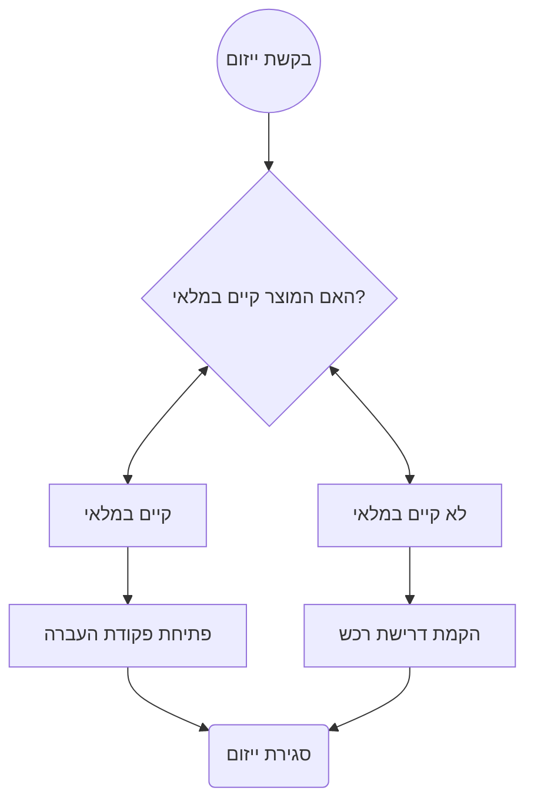

`

[[2021-05-23]]
	
# חידוש מערכת טופס ייזום
	
[[index.html]]/[[Open University]]/[[ERP]]/[[טופס ייזום]] 
[[index.html]]/[[Open University]]/[[APEX]]/[[טופס ייזום]]

> במהלך השנים, נוצרו מספר תהליכי רכש בארגון. יש שמבוצעים חלקית במערכת ה-ERP ויש שמבוצעים באופן מלא. התהליכים המפורטים להלן הינם רק עבור תהליכי הרכש שמבוצעים כולם בתוך המערכת. 

## רקע
מערכת ייזומי רכש הינה מערכת שנועדה לתעד ולנהל בקשות רכישה של כלל מגורמי רכש מקצועיים (יפורט בהמשך).
בשלב מאוחר יותר בתהליך, הגורמים מקימים דרישת רכש במערכת ה-ERP המבוססת על הבקשה שהקימו המשתמשים.
בנוסף לבקשות הרכישה המסתיימות בהזמנת רכש וברכישה בפועל, ישנן בקשות רכישה שהמענה להן קיים במלאי הארגון ולכן תוצאתן הינה אספקת מלאי פנימי. 

1.  במקורה, המערכת נועדה **לתיעוד** הבקשות אל הגורמים המקצועיים, באמצעות טופס מאוחד ומסודר.

2. כיום המערכת בנויה בPL-SQL Cartridge אשר הינה שיטת בניית דפי WEB ישנה וקשה לתחזוקה ולשינויים.

3. המערכת שברצוננו לבנות, הינה שדרוג טכנולוגי של מערכת קיימת הבנוייה בטכנולוגיה ישנה ומיועדת להחליף אותה. מירב התהליכים אמורים להשאר כמות שהן.

4. המערכת עתידה להיבנות על תשתית פלטפורמת האפליקציות - Oracle APEX.

### 1.2.1 לקוח \\ משתמש עיקרי

משתמשי המערכת המרכזיים יהיו כדלהלן:

1.  משתמשי מבקשי הייזום
	1.  מקים בקשת הייזום
	2.  מנהל הישיר של מקים הבקשה
2. משתמשי הגורם המקצועי - מקבל בקשות הייזום
	1. מקים הדרישה 
	2. משתמש מנהל אחר שישוייך לגורם מקצועי.
3. גורם רכש
	1. קניינית
	2. משתמש מנהל קניינות

### 1.2.2 מומחה(י) היישום

מומחה היישום: יקי קמחי – מיישם לוגיסטי ואחראי על תחום הרכש במערכת הERP.

##  חשבונאות ותקציב
### 2.1.1 קומבינציה חשבונאית

כל פעולה, במערכת ה-ERP, שיש בגינה רישום חשבונאי, מזכה קומבינציה חשבונאית אחת ומחייבת את האחרת.

כל קומבינציה חשבונאית בארגון מכילה, בין היתר, את הסגמנטים הבאים:

A. מחלקה: מספר מזהה של המחלקה שהוגדרה בארגון האו"פ כמחלקה נפרדת. דוגמא: "7123 – שיווק ופרסום", "4123 – הפקה" ועוד.

B. תת חשבון: מספר מזהה של קטגוריית ההוצאה. לדוגמא: " 0649 – מחשוב אישי – רכישות חומרה", " 1013 – טלפונים רכישות ואחזקה".

### 2.1.2 תקצוב

הפרמטרים המרכזיים בתקצוב הרכש הינם סגמנט תת החשבון והמחלקה. ישנם גורמים שמצטרף לתקצוב היבטים נוספים כגון: קרן, פרוייקט וכו'

### 2.1.3 ניהול וניצול התקציב

התקציב אמנם מנוהל בתוך המחלקה, אך ניצול התקציב במערכת ה-ERP מתבצע דרך הגורם המקצועי האחראי על תת החשבון המנוצל(ראה הסבר להלן)

השיריון התקציבי מבוצע עם הקמת הדרישה במערכת אך הניצול בפועל של התקציב מתבצע עם אישור החשבונית בעד השירות.

### 2.1.4 גורם מקצועי

גורם מקצועי הינה מחלקה שמעניקה למחלקות אחרות שירותים היחודיים להתמחות המקצועית שלה. כך לדוגמא: מנהל המחשוב מציע שירותים וטובין בתחום המחשוב ליתר מחלקות האופ.

בד"כ הגורם המקצועי יהיה זה שיניע את תהליך הרכש וכן אישור ההוצאה בפועל עבור תתי חשבון שבאחריותו.

## תהליך הייזום כיום
### 2.2.1 הקמת מסמך הייזום

המחלקה היוזמת פונה (בד"כ טלפונית\\מייל) לגורם המקצועי ומבקשת שירות כלשהו. לדוגמא: חוקר במחלקה לאנגלית מעוניין במחשב מסויים, הוא פונה למזכירת המחלקה והיא מעבירה את בקשתו לדלית גרשי ממחלקת משו"ב במנהל המחשוב.
הגורם המקצועי מבקש מהמחלקה היוזמת שתקים מסמך ייזום לצורך תיעוד הבקשה והמענה.
מסמך הייזום כיום, הינו טופס אינטרנטי הבנוי בטכנולוגיית PL/SQL Cartridge , אשר הינה טכנולוגיה מיושנת ובעלת בעיות תאימות ואבטחה.
הגישה לטופס הייזום אמנם הינה מתפריט מערכת ה-ERP אך הטופס אינו חלק אינטגרלי מן המערכת המקורית, אלא הנתונים המוזנים בטופס 
נרשמים בטבלה מקוסטמת (OP\_INITIATING\_DETAIL\_ERP).
### מבנה הנתונים  בטופס הייזום
כיום, מבנה הנתונים הינו מבנה רחב וחד שורתי לכל בקשה. כך שאם המשתמש מעוניין בכמה פריטים שונים, יהיה עליו להזין 
מספר טפסים כמניין מספר הפריטים השונים שאותם הוא מבקש לרכוש.
דוגמא לטופס ייזום קיים: 
![[Pasted image 20210527184232.png]]

### 2.2.2  מסמך הייזום הנוכחי בטבלת הנתונים (OP\_INITIATING\_DETAIL\_ERP)
> **עבור השליפות שמאחורי חלק מן הנתונים: [[Initiation Form - Queries]]**

| שם השדה                     | שם השדה בטבלה     | קישור |
| --------------------------- | ----------------- | -- |
|                             |                   | |
| מספר ייזום                  | ID\_INITIATING    | |
| תאריך                       | TARICH\_KTIVA     ||
| סטטוס                       |                   |  |
| פרטי היוזם                  |                   |[[Initiation Form - Queries#5 1 פרטי היוזם – שליפה בטופס קיים]]|
| מופנה אל גורם מקצועי (תחום) |                   | [[Initiation Form - Queries#5 2 מופנה אל גורם מקצועי – שליפה בטופס קיים]] |
| שם מנהל מחלקה מאשר          |                   |[[Initiation Form - Queries#5 3 שם מנהל מחלקה מאשר – שליפה בטופס קיים]] |
| פרטי אב\\שירות              |                   |[[Initiation Form - Queries#5 4 פרטי אב שירות – שליפה בטופס קיים]] | 
| תאור\\נימוק לצורך           | TEUR              ||
| כמות                        | KAMUT             ||
| מחיר משוער (כולל מע"מ)      | PRICE             ||
| מטבע                        | CURRENCY          |[[Initiation Form - Queries#5 5 מטבע – שליפה בטופס קיים]]|
| סה"כ עלות                   | ALUT              ||
| דרוש עד                     | TARICH\_DRISHA    ||
| אתר אספקה                   | LOCATION          |[[Initiation Form - Queries#5 6 אתר אספקה – שליפה בטופס קיים]] | 
| בניין\\קומה\\חדר            | TEUR\_LOCATION    ||
| שם המקבל                    | RECEIVER\_NAME    ||
| קרן                         | FUND              ||
| חשבון                       | ACCOUNT           ||
| מחלקה תקציבית               | DEPARTMENT        ||
| תת חשבון                    | SUB\_ACCOUNT      ||
| פרויקט\\מחקר                | PROJECT\_RESEARCH ||
| אתר                         | SITE              ||
| הערות                       | HEAROT            ||
| פרטי דרישה                  |                   ||
| הערות גורם מקצועי           | HEAROT\_GOREM     ||
| מילוי ע"י גורם מקצועי       |                   |[[Initiation Form - Queries#5 7 מילוי ע י גורם מקצועי – שליפה בטופס קיים]]|
| סיבת דחיה                   | REJECTION         ||

### 2.2.3 אישור מסמך הייזום

כיום אין תהליך אישורים למסמך הייזום. כל מסמך שהוזן יכול להפוך ע"י הגורם המקצועי לדרישת רכש . (ולאחר מכן להזמנת רכש)

### 2.2.4 ניהול מסמך הייזום

לאחר שהגורם המקצועי מיודע (מייל מערכת) על כך שנפתח עבורו מסמך הייזום, הוא נכנס למערכת ומסוגל לצפות בו.

באם הגורם המקצועי רואה שאין צורך בביצוע רכישה אלא ניתן לספק את הצורך באמצעות ניפוק מהמלאי, הוא בוחר באופציה הזו ובכך סוגר למעשה את טופס הייזום.

באם נדרש לבצע רכישה, בחלק מן המקרים, הגורם המקצועי פונה(במייל\\טלפון) למחלקת הרכש ומיידע את הקניין האחראי לגבי הצורך. הקניין מטפל בבקשה ע"פ נוהל הרכש ובסיום הטיפול הוא יידע את הגורם המקצועי לגבי העלות ו\\או פרטים אחרים שיש להזין בדרישת הרכש.

### 2.2.5 הקמת דרישת רכש

בשלב שבו תמונת הרכש ידועה לגורם המקצועי, הוא מקים במערכת ה-ERP את דרישת הרכש במערכת. זאת הנקודה הראשונה בתהליך הרכש שמבוצע בתוך מערכת ה-ERP ובה מתבצע השיריון התקציבי הראשוני במערכת. תהליך הקמת דרישת הרכש הינו תהליך ידני של יצירת דרישת הרכש על בסיס טופס הייזום. באם דרישת הרכש מוקמת ע"ב הייזום, הנתונים מועתקים באופן ידני (Copy/Paste) אל דרישת הרכש. בשורת דרישת הרכש קיים שדה Attribute שמכיל את מספר הייזום (ניתן שמספר שורות דרישת רכש יכילו את אותו מספר ייזום) ולפי זה ניתן לדעת מהדרישה על איזה טופס ייזום הדרישה מבוססת.

בעיות שיתוארו בהמשך:

\- בעיות אבטחת מידע.
\- טכנולוגיה ישנה וקשה לתחזוקה
\- חוויית משתמש
\- הנגשת הטופס ע"פ חוק.
\- מספר רב של משתמשים.
\- קישוריות בין מסכי הייזום למסכי ERP.
\- אישור טפסי ייזום פנים מחלקתי
\- סנכרון וזרימת המידע במערכת
\- אפשרות הקמת ייזומים מרובי שורות

### 2.3.1 תיאור הבעיות

*טכנולוגיה ישנה וקשה לתחזוקה*: הטופס הנוכחי בנוי בטכנולוגיית PL/SQL Cartridge שהינה טכנולוגיה ישנה וקשה לתחזוקה והתאמה לדפדפנים מתקדמים. בעקבות זאת, כל התקנת תוסף (Patch) במערכת, העלאת גרסת דפדפן, הוספה או אפילו הזזה של אובייקטים הינה בעייתית ויכולה להזיק להתנהלות התקינה של הארגון.

*חווית משתמש*:  משתמשי המערכת חווים קשיים בהתמצאות בטופס ובהבנת הנדרש מהם, לאור הטכנולוגיה הישנה שבה הוא בנוי ויכולותיו המועטות.

*קישוריות בין הטופס למסכי הרכש*: כיום, לא ניתן לעבור ישירות מהטופס ייזום אל הדרישה המקושרת אליו וכן לא לעבור ישירות מהדרישה אל הטופס. נדרש מהמשתמש להעתיק את מספרי הייזום והדרישה ולחפשם באופן פרטני במסכי החיפוש הייעודיים.

*הנגשת הטופס*:  הטופס אינו מונגש לבעלי מוגבלויות קריאה.

*מספר רב של רשיונות משתמשים*: ישנם משתמשים רבים במערכת שאין להם שום פעילות במערכת ה-ERP מלבד הקמת טופס ייזום. נדרש להציע פתרון שבמסגרתו משתמשים כגון אלו, יוכלו להקים טפסי ייזום מבלי להיות מוקמים כמשתמשי ERP.

*אישור טפסי ייזום*: כיום לא נדרש אישור, פנים מחלקתי, לטופס ייזום. כלומר, ייתכן ותוקם דרישה ולאחריה הזמנה מבלי שבתוך המחלקה היוזמת הייזום אושר.

*סנכרון וזרימת המידע במערכת*:

\-  משתמש שהקים ייזום, אינו מודע לתהליכי הרכש שקורים בטרם הייזום הופך לדרישה במערכת ה-ERP.

\- כאשר החליט הגורם המקצועי להפוך את הייזום לדרישה, הוא נאלץ לבצע העתקה ידנית של פרטי הדרישה ממסמך הייזום אל תוך הדרישה שהוא מקים. כאשר זה עלול לגרום לטעויות העתקה ולתהליך הקמת דרישה מסורבל.

\- ישנם דרישות רכש שנדרש להקימם רק לאחר סיום איסוף שלש הצעות מחיר ובחירת ההצעה הזוכה, בינתיים הגורם היוזם אינו מודע לתהליך המתרחש ברקע ובאם הוא מעוניין לדעת, הוא יוצר קשר טלפוני\\מייל\\אחר עם הגורם המקצועי ע"מ להתעדכן. נדרש לתת פתרון שבמסגרתו המידע יועבר באופן יעיל לכל הגורמים.

\- מפעם לפעם "קמים לתחיה" ייזומים ישנים שבטעות גורם מקצועי מקשר לשורת דרישת רכש.

אפשרות הקמת ייזומים מרובי שורות: לא ניתן להקים מסמך ייזום מרובה שורות. כל מסמך ייזום הינו עבור פריט יחיד, דבר המאלץ גורם להקים מספר מסמכי ייזום במדה והוא מעוניין אפילו רק בחלוקת החיוב למספר מחלקות, או למספר גורמים תקציביים.

מטרות חידוש המערכת הינם:

. **חסכון בעלויות**:  כיום, הסכומים המשולמים לחברת אורקל הינם לפי כמות המשתמשים. באם נסגור את חשבונות המשתמשים שהופעלו רק לצורך הקמות מסמכי ייזום, נוכל לחסוך בכך כספים רבים לארגון מדי חודש בחודשו.

. **ידידותיות למשתמש**: האפליקציות המפותחות בפלטפורמה זאת הינם ידידותיים ביותר למשתמשים וקלות להתמצאות.

· **הפשטת תהליכים:** נדרש לאפשר למשתמשים לציין בקלות ובפשטות את הפריט\\שירות לו הם נצרכים ובכך לחסוך באי נעימות ובזמן עבודה. כתוצאה מהפשטת התהליך, יותר רכישות יתבצעו דרך המערכת ובכך תהליכי הרכש ימוסדו ביתר יעילות.

· **ייעול תהליכים:**  על תהליכי הרכש להיות מבוקרים מתחילתם ועד סופם. כיום, ישנם תהליכים רבים שאינם יעילים בשימוש בכלים הקיימים ויש לייעל תהליכים אלו וע"י כך לייעל את תהליך הרכש כולו.

· **ייעול תהליכים2:** התהליכים כיום מצריכים הן הזנת הייזום והן הזנת הדרישה. התכליכים יתועלו כך שהדרישה תוזן ע"ב הייזום ולא תידרש הזנתה החוזרת ע"י הגורם המקצועי.

· **ייעול תהליכים3:** תהליך הרכש עובר לרוב, דרך איסוף הצעות המחיר. יש לנהל אותם במערכת ובכך לאפשר שימוש חוזר בהצעות מחיר שנתקבלו, ניהול תוקף הצעות המחיר במערכת ועוד.

· **הנגשה לבעלי מוגבלויות:** יש להנגיש את כל כלי המערכת לבעלי מוגבלויות ובכללם קשיי ראיה. שלא במערכות הייזום הנוכחיות, האפליקציות הנבנות בפלטפורמת APEX  הינם מונגשים ונהירים לבעלי מוגבלויות.

· **שקיפות התהליך:** כיום התהליכים מתבצעים, בחלקם, מחוץ למערכת. דרך תכתובות מייל ושיחות טלפון. נדרש לספק כלים שיאפשרו ניהול ובקרה של כל תהליכי הרכש. בנוסף, ניתן יהיה לחשוף ליוזם את התקדמות הטיפול בייזום אותו הוא הקים ובכך למנוע אי הבנות ובזבוז זמן.

· **מדידת יעילות:**  בנוסף לייעול התהליכים, יש לאפשר מדידת היעילות הן בנוגע לזמני הטיפול והן בנוגע לאיכות המענה. באמצעות יישום המערכת, יתאפשר למדוד כל אחד משלבי הרכש ולהעריך נכונה את זמני הרכש והאספקה.

· **שיפור אבטחת המידע:** כיום הדפים נסמכים על פלטפורמת תקשורת (PLSQL Cartridge) הישנה ופגיעה מפלטפורמות חדשניות ומאובטחות כAPEX.
## התייעצויות שבוצעו לצורך קבלת החלטה על עדכון תהליך הייזום
### 3.2.1 ריקי שפיים, מדור הרכש, 14/01/2019

מטרות הפגישה: התייעצות בנוגע לאופן איפיון וסימון הגורמים המרכזיים שמשתמשים, או שאמורים להשתמש בטפסי הייזום.

מסקנות הפגישה:

\- יש להתייעץ אף עם הגורמים המקצועיים ונציגיהם כדלהלן:

- מרכז לוגיסטי: אודי פלד
-  אחזקה: קובי גווילי
- תקשורת: שי לוי
- מחשוב: דלית גרשי
- תחבורה וביטחון: דפנה רושט

כמו"כ יש: 
\- לבדוק את הצרכים הבסיסיים להקמת דרישה באופן אוטומטי מטופס הייזום.
\- לשכלל את שיטת בחירת הגורם המקצועי כי לעתים היוזם יודע לאיזה אדם הוא צריך להקים ייזום, אך לא יודע מהו שם הגורם המקצועי שאליו הוא שייך. ההמלצה היא לאפשר בחירת הגורם המקצועי אף באמצעות בחירת אנשי הקשר שלו.
\- לתת מענה לצורך העולה תדיר, של העברת נמען טופס הייזום מגורם מקצועי לאחר. ע"מ שיוזמים לא ייצטרכו להזין את כל הטופס מחדש – כפי שזה כיום.

### 3.2.2 דלית גרשי, מנהל המחשוב, 17/01/2019

מטרת הפגישה: איפיון ראשוני של טופס הייזום החדש בהיבט הצרכים של מנהל המחשוב.

מסקנות הפגישה:
\- תהליך כיום: מייל לדלית מהגורם היוזם ß בדיקת ובירור הצורך ß אם מתברר שיש צורך, הקמת ייזום. ß אם קיים במלאי, סגירת הטופס בתוצאה של ניפוק מהמלאי. אם לא קיים במלאי ואין חוזה\\הסכם מסגרת, פניה למנהל הרכש בבקשה להצעת מחיר לרכישה. ß הקמת ייזום ע"ב הצעת המחיר שנתקבלה ממנהל הרכש.
\- מבחינת דלית, יש ערך לחשיפת הגורם היוזם להתקדמות תהליך איסוף הצעות המחיר והתקדמות הרכש.
\- מציעה הקמת תבניות של ברירת מחדל לפי גורם מקצועי, כך שלדוגמא עבור הגורם המקצועי מנהל המחשוב, אתר ההספקה יהיה או"פ רעננה.

### 3.2.3 ניר מלכה, מנהל הלוגיסטיקה – רכב ותחבורה, 17/01/2019

מסקנות הפגישה:
\- טופס הייזום אינו בשימוש מאחר ואין במבנה הנוכחי של המידע כל ערך נוסף לצרכי מדור התחבורה.
\- תיבנה מערכת ייזומים נפרדת להזמנת נסיעות.

### 3.2.4 אודי פלד, מנהל הלוגיסטיקה - מרכז לוגיסטי, 17/01/2019

מסקנות הפגישה:
\- שיהיה קשר חזק ודו כיווני בין הייזום לדרישה שנוצרה בעקבותיו.
\- יצירת לינק שיפתח את טופס הייזום מתוך הדרישה.
\- אפשרות ליוזם לציין מק"ט, במדה ויודע אותו.
\- לאפשר ליצור בקשה להצעת מחיר מהרכש, בהתבסס על טופס ייזום.
\- המלצה למתן אפשרות של הגורם המקצועי לראות את יתרות התקציב שלו בתתי החשבון ושל יוזם לראות את היבטי התקציב שלו במחלקה.

### 3.2.5 קובי גווילי, מנהל הלוגיסטיקה – אחזקה, 28/01/2019

מסקנות הפגישה:
\- חשוב שיהיה גורם מאשר לייזומים, במחלקת היוזם.
\- חשוב שהמשתמש יהיה מיודע בתהליך הייזום, לאישור הטופס ולטיפול בו.

### 3.2.6 דפנה רושט, מנהל הלוגיסטיקה – בטחון, 10/02/2019

מסקנות הפגישה:
\- חשוב לשמור על שקיפות התהליך מול היוזם.
\- חשוב לתעד את הסגמנטציה של הייזום.
\- על המערכת לקחת אחריות על תהליך הייזום והיידוע של כל הגורמים באופן מלא.
\- יש לקשר בקשר חזק את הייזומים לדרישות ולהיפך. כך שמהייזום יהיה ניתן לפתוח את הדרישה ומהדרישה יהיה ניתן לפתוח את הייזום.
\- ממליצה ליישם מנגנון הפיכת ייזום לדרישת שחרור מהסכמי מסגרת.
\- לפרק את מסמך הייזום לרמת כותרת + שורות ולא כפי שזה כיום שהכל ברמת הכותרת.

### 3.2.7 שי לוי, מנהל הלוגיסטיקה – אירועים ותקשורת, 10/02/2019

מסקנות הפגישה:
\- להפריד בין מאשר הייזומים בגורם המקצועי לבין מקים הדרישות מהייזום הזה. כך ששי לוי יאשר את הייזום ויפעת תקים את הדרישות.
\- רואה חשיבות גבוהה להקמת מנגנון בל"מ מול מדור הרכש והחזרת הצעת מחיר מהם.
\- יש צורך ביידוע היוזם ושקיפות התהליך מולו.
\- חסר לו כלי בשלב מוקדם שיידע את הגורם המקצועי ביתרות התקציב לפי תת חשבון ומחלקה.
\- איפשור העברת ייזום מגורם לגורם, כי מקימים עבורו ייזומים שאין הוא האחראי עליהם.
\- שיתאפשר צירוף קבצים ע"י הקניין.

