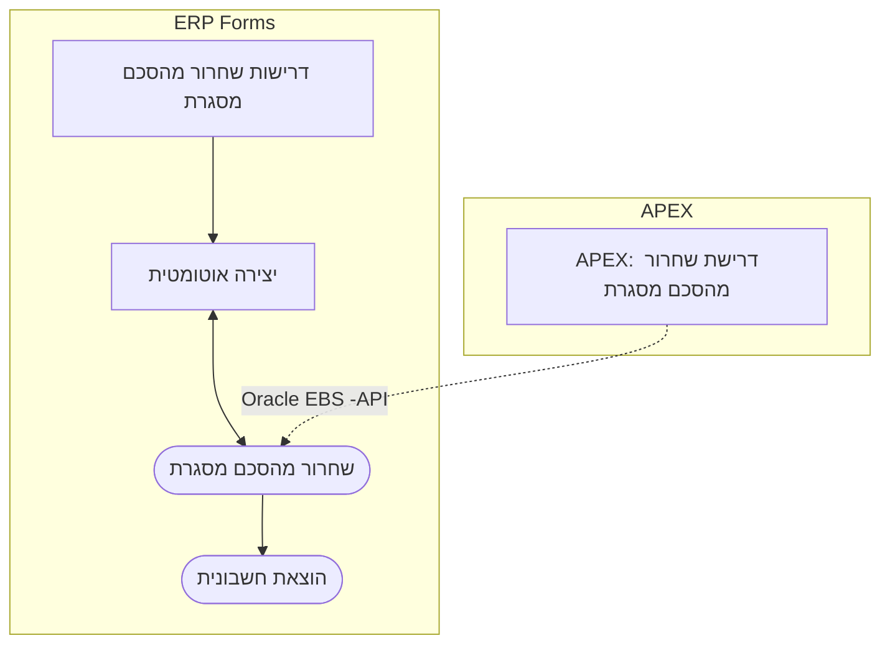

Week Of: [[2021-06-20]]
[[2021-06-21]]

#  תזכיר \ סיכום פגישה - הזנת שחרורים מהירה מהתקשרויות 
[[home]]/[[Open University]]/[[Memos]]

## רקע\תיאור
1. אבי הציף בעיה לגבי התקשרויות רבות שניתן היה להעבירן דרך תהליך הרכש באם היה ניתן לייסד תהליך מהיר של הזנת שחרורים מהירה מהסכמי מסגרת וללא מעבר דרך תהליך הדרישה.
2. רבקה שבה ובקשה פתרון לבעיה שמציקה לקנייניות ובמסגרתה ישנם מתקבלים הזמנות רכש עם משתמש הרשום כמבקש שבשלב הוצאת החשבוניות נתקלים בשגיאה בגינו, בכך שאינו נכלל ברשימת המאשרים. 
3.  בנוסף להנ"ל, רבקה העלתה בעיה נוספת שקורית בשחרורים מהסכמי מסגרת שנוצרים ו**מאושרים** ובגלל הבעיה הנ"ל חוזרים לתיקון שם המבקש.
4.  רבקה ואבי הביעו ענין בהצגת הפתרון של מערכת הנסיעות שפותחה עבור מחלקת הבטחון. 
## משתתפים
- אבי הפנר
- רבקה שפיים
- יקי קמחי
## מסקנות ופעולות
1. הוצע פתרון אפשרי שבמסגרתו תהליך הזנת השחרורים מהסכמי המסגרת יימשך כסדרו אך יתאפשר לציין התקשרויות מסויימות שמהן יינתן לשחרר בתהליך מהיר שייבנה במערכת חדשה על פלטפורמת APEX.  תרשים ההצעה:

2. אבי העלה את החשש כי המערכת תפרוץ נהלי רכש פנימיים - הן בהיבט מחלקת הרכש והן בהיבט הגורמים המקצועיים ולכן הובן כי יהיה צורך לבצע איפשור באופן פרטני להתקשרויות שיוחלט להעבירן במסלול המהיר.
3. אבי ורבקה יזמנו ישיבה נפרדת שבה אציג את מערכת הנסיעות. 
4.  אבי ורבקה ידונו בעניין המערכת המוצעת ונתכנס שוב לשם החלטה ואיפיון, במדה ויוחלט לבצע.
 - [x] #task יקי - לבצע בדיקה ותיקון בקרת מאשרי חשבוניות שבהן נדרש אישור המבקש 📅 2021-06-22 ✅ 2021-06-22
 - [x] #task יקי - לבצע את [[ PO Personalization - Requestor Approval]] שבהן נדרש אישור המבקש אף בדרישות הרכש. 📅 2021-06-23 ✅ 2021-06-22
 
#op/erp/po 
#mermaid 
#memo 
#op/memo