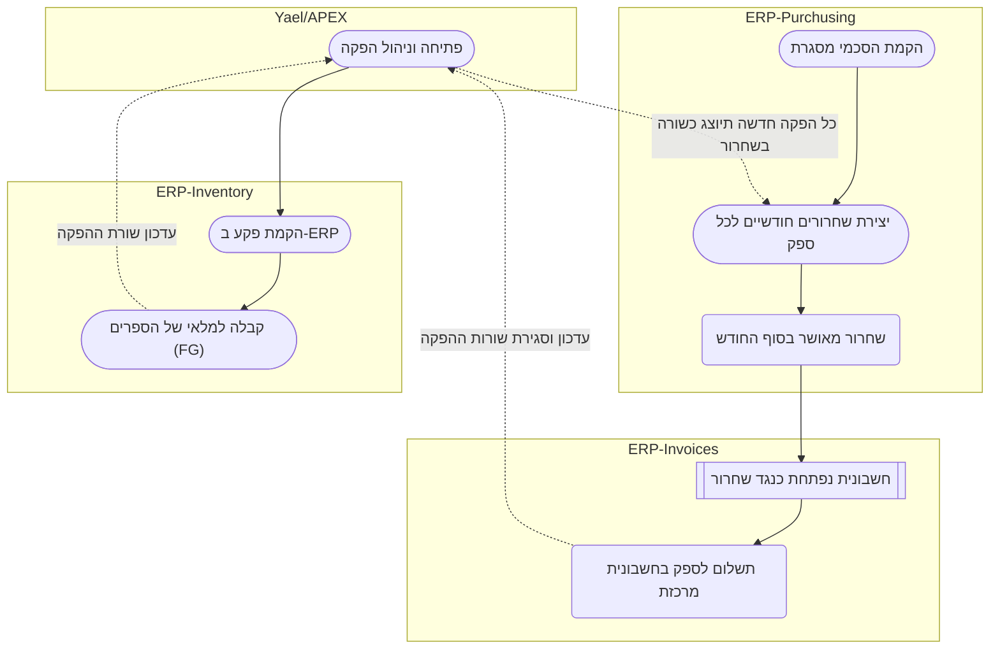

Week Of: [[2021-07-18]]
[[2021-07-18]]

[[home]]/[[Open University]]/[[ERP]]

```mermaid
graph TD	
	yael(["פתיחה וניהול הפקה"])
	subgraph ERP-Purchusing
	blanket(["הקמת הסכמי מסגרת"])
	release(["יצירת שחרורים חודשיים לכל ספק"])
	blanket --> release 
	release --> approve("שחרור מאושר בסוף החודש")
	end
	subgraph ERP-Invoices
	invoice[["חשבונית נפתחת כנגד שחרור"]]
	invoice --> invapprove("תשלום לספק בחשבונית מרכזת ")
	approve --> invoice
	end
	subgraph Yael/APEX
	yael -. "כל הפקה חדשה תיוצג כשורה בשחרור" .-> release
	invapprove -. "עדכון וסגירת שורות ההפקה" .-> yael
	end
	subgraph ERP-Inventory
	yael --> erp(["הקמת פקע ב-ERP"])
	erp --> inventory(["קבלה למלאי של הספרים (FG)"])
	inventory -. "עדכון  שורת ההפקה" .-> yael
	end
```
