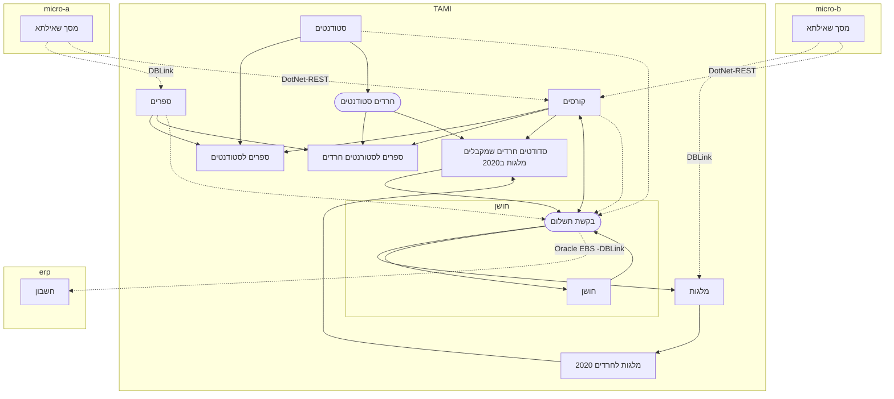
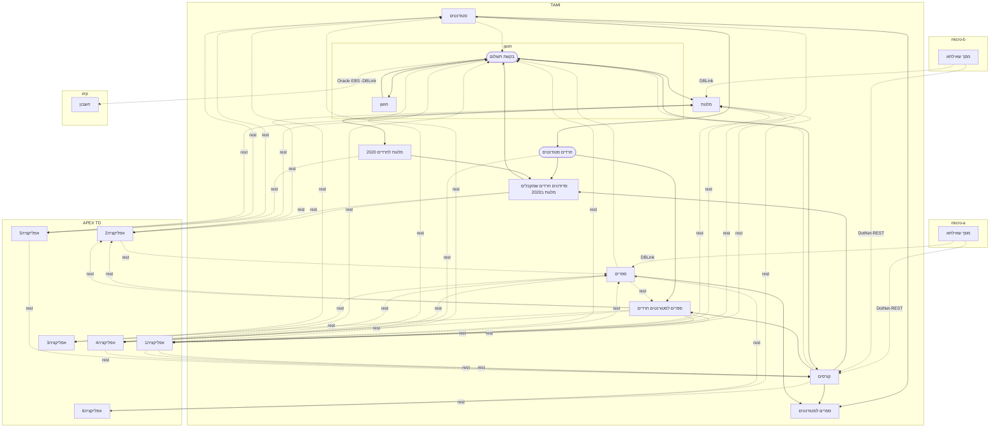

# אתגרים בארכיטקטורת שירותים - OP

## פנינו לאן
### המצב כיום

---

---

### המצב הרצוי?

---

### מה עושים

## מי אחראי לבצע?
### המצב הרצוי
- איכות:
	1. בדיקת עומסים
	2. אחריות על תהליך רישום השירותים
	3. AB Testing של שירותים
	6. המלצה וניהול הגבלת מספר הפניות ליום
- Architecture product management - ניהול מוצר ברמת הפלטפורמה
	1. אחריות עסקית על פלטפורמות הפיתוח + הAPIM הכולל:
		1. תמיכה בבעיות תקשורת בין השרתים
		2. Authentication + Authorization בין שרתים ושירותים
		3. רישום השירותים
		4. לא ניתן לצרוך שירות, מי האחראי?    
	4. אחריות ומעקב על מימוש בפועל של הארכיטקטורה בראיה אסטרטגית ארגונית
	5. הכנת הארגון לתהליכי פיתוח מודרניים. 
		1. באלו כלים לבצע Deploy, שמירת גרסאות, CI/CD  
	6. תיאום בין דרישות גופי הפיתוח והמוצר לבין אנשי התשתיות. 
	7. מתווה פתיחת שירותים החוצה
	8. הדרכה ובקרות בפיתוח web 
	9. ספריות קודUI  – ניהול תצורה מרכזית
- פיתוח
- product management

### מה עושים

## מומחיות בארגון
פיתוח Web 
Git

### המצב הרצוי

### מה עושים

## הדרכות רוחביות

### המצב הרצוי
### מה עושים
