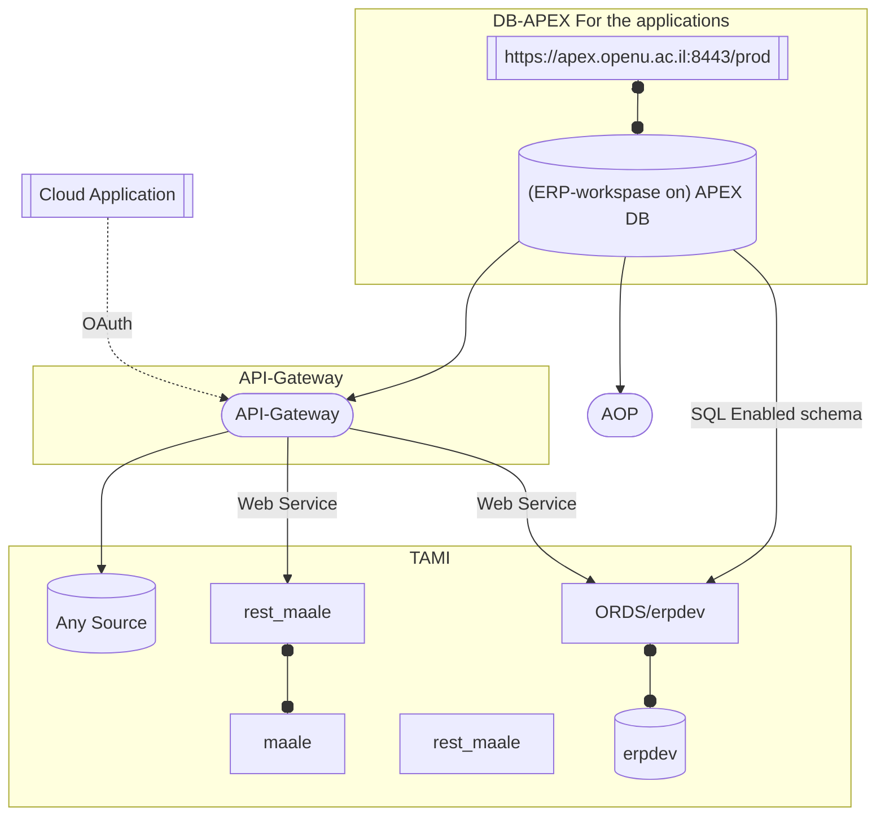

---
tags: [notes, memo, op] 
created: 2021-12-15 13:55
modified: 2021-12-15 14:05
type: Document
title:  אגרגציות נתונים ל-APEX 
---
Week Of: [[2021-12-12]]
[[2021-12-15]]

# סיכום פגישה בנושא  אגרגציות נתונים ל-APEX

[[home]]/[[Open University]]/[[Memos]]

## רקע\תיאור

## משתתפים

## מסקנות ופעולות

- [ ] 
 
#memo #op/memo
