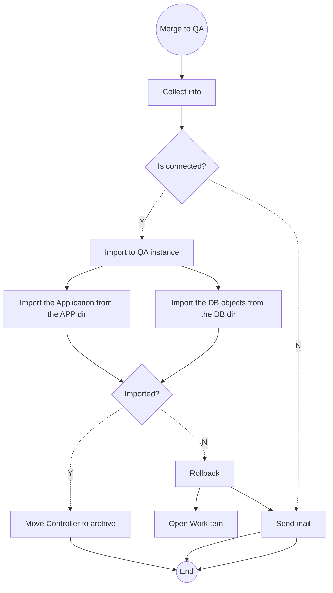

Week Of: [[2022-01-16]]
[[2022-01-19]]

#  תזכיר בנושא  תכנון תהליך ה-Build של אפליקציות APEX

[[home]]/[[Open University]]/[[Memos]]

## רקע\תיאור
תהליך ה-Build יהיה מורכב מהתהליכים הבאים:
תהליך TEST:
Trigger: Merge into QA branch
Step 1: Collect the TNS and credentials
Step 2: Import the Application
Step 3: Import the DB Objects
Step 4: move the controller.xml to archive

## משתתפים

## מסקנות ופעולות

- [ ] 
 
#memo #op/memo
