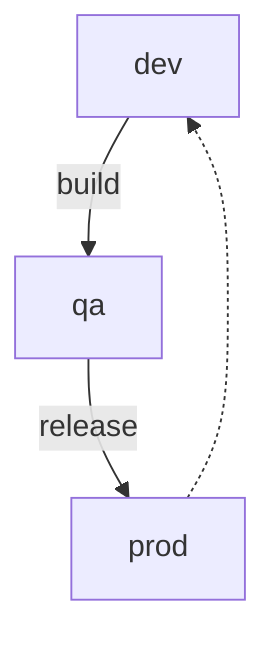

Week Of: [[2022-04-03]]
[[2022-04-07]]

[[HOME]]/

# השיטה
## סביבות 
סביבות הבסיס יהיו:
- DEV: לפיתוח + בדיקות משתמשים.
- QA: ([[APEX-Runtime]] Only)  לבדיקות תקינות ההעברה 
- PROD:  ([[APEX-Runtime]] Only)סביבת הייצור  
- Patch - לבדיקות שדרוגים ופיתוחי אפליקציות ניהול המערכת.

## ספריות קוד
ניהול באמצעות Git כאשר הקוד הנמצא בענף ה-Master הינו קוד ה-PROD  או לפחות Ready To Prod.
#### ניהול הענפים ב-GIT
##### Bag Management
תיקוני הבאגים (או כל שינוי שאינו במסגרת וורסיה שלמה) ינוהלו באמצעות ה GIT - בשיטת Trunk-based. ([[2022-02-17N1 - ניהול תצורה ב-APEX | פירוט תקציר שיטות הניהול]])
בשאיפה שאורך החים הממוצע של כל Branch מלבד Master יהיה לכל היותר ימים בודדים.
#####  Features Management 
של האפליקציות, שזה כל פיתוח לטווח ארוך, לא ינוהל באמצעות Branches  של Git אלא באמצעות ניהול הוורסיות שמאפשרת פלטפורמת ה-APEX תוך היעזרות בBuild Option של ה-APEX. (כדי שקוד שלא מעוניינים שיגיע ל-PROD טרם זמנו לא ייוצא ביחד עם תיקוני הבאגים)
##### Pull Request
כל דחיפת קוד לענף הראשי תבוצע באמצעות הקמת ענף (בעל אורך חיים קצר - עד שבוע) ומיזוגו (Merge) לענף הראשי באמצעות Pull Request שיאושר ע"י מנהל צוות הפיתוח\Release Manager

## מחזור פיתוח 
### הקמת משימה 
זוהה Bug ונפתחה משימה -Work Item במערכת הAzure DevOps. או שהוקמה משימה לתוספת מבוקשת, פיתוח נדרש וכו'
המשימה סומנה כמשימה לטיפולו של המפתח.
המפתח ביצע את המשימה ומעוניין להעביר את הקוד של האפליקציה וכן את האובייקטים שנוספו\שונו והנדרשים לפעילותה של האפליקציה
## ייצוא הקוד
באמצעות  Shell-script שמבצע התקשרות לסביבות ה-Dev (של ה-APEX וכן של ERP + האקדמית) ופריסתו במבנה מוסכם ב- Local Repository של Git  על מחשבו של המפתח.
### Commit & Push
יבוצעו בתדירות הגבוהה ביותר האפשרית ובענף הזמני שנוצר לצורך הטיפול ב-Bug 
## אוטמציית העברת הפיתוח
### PR
בסיום הטיפול בבאג, יפתח המפתח PR לצורך מיזוג הקוד לענף ה-Master.
הבקשה תאפשר Code Review וכן קשירת ה-Work Items של הבאגים שטופלו במסגרת הקוד המתוקן.
הבקשה תחייב אישור מנהל הצוות של המפתח.
### Deploy to QA
בעת הקמת Pull Request, מונע תהליך Deploy שבמסגרתו הקוד שנמצא בענף הממוזג יקומפל בסביבות QA.
באם התהליך הסתיים בתקינות, המערכת תאפשר את סגירת ה-PR שיבצע גם את המיזוג של הקוד לענף ה-Master.
במקביל, המערכת תבצע Complete למשימות שצויינו ב-PR ושנכללו במסגרת המשימות שטופלו.
### Release to PROD
באם ההעברה הסתיימה בתקינות, יווצר קובץ Artifact שיכיל את הקוד האפליקטיבי וכן האובייקטים ושבשלב ה-Release יקומפל גם בסביבות הPROD השונות.
לאחר בדיקת ההעברה התקינה, ייפתח Release לסביבת ה-PROD הרצויה.
במקביל, בספריית ה-GIT, הענף ימוזג לענף ה-Master.
## כלים בשימוש 
- [SQLcl](https://www.oracle.com/il-en/database/technologies/appdev/sqlcl.html) - כלי של אורקל שמכיל יכולות כשל כלי SQL Plus  
- [Liquibase](https://www.liquibase.org/) - ספרית קוד פתוח לצורך ניהול גרסאות של אובייקטי DB. אורקל הטמיעו את הספריה בתוך SQLcl
- Git Remote- [Azure DevOps Services ](https://azure.microsoft.com/en-us/services/devops/) 
-  CI/CD and Pipeline - Azure DevOps 
- Build Agent - Ubuntu 18.1
- Work Items - Azure Devops
-  
