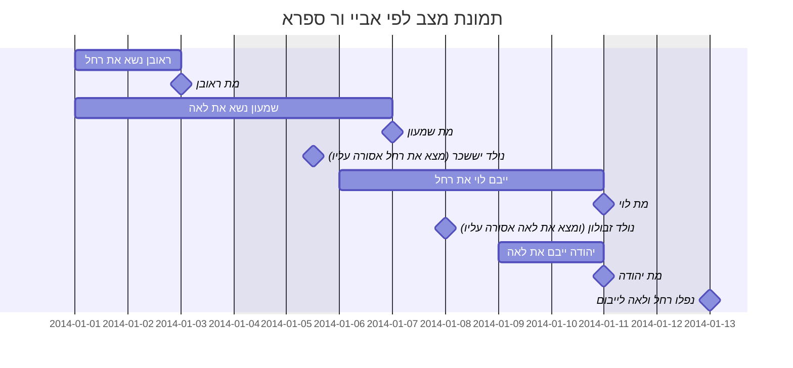

[הדף הקודם](../2022-03-15)

### שיטת חכמים
שחלקו על רבי, בלימוד הפסוק "ולקחה" מלמדם שהיא נעשית כאשתו לכל דבר ואם ירצה לגרשה יגרשה בגט ואם יתחרט יוכל להחזירה ולא ישוב האיסור של אשת האח.
"ויבמה" - ללמד שאם בא עליה בעל כרחה קנויה לו. 
רבי ילמד את זה מ"לאשה" (ולקחה לו לאשה) ובעל כרחה מ"יבמה יבוא עליה".
### מה יעשה רבי עם "עליה"
אם לא למד את הדרשה של עליה לאחות אשה, אז מה ילמד מזה? 
אלא שהוא ילמד שבית דין חייבים להביא פר העלם דבר של ציבור רק על דבר שאם עשה אותו היחיד הוא היה מביא על זדונו כרת ושגגתו חטאת. כמו כן, לא מביאים פר לעולה ושעיר לחטאת על שגגת עבודת כוכבים, אלא רק על דבר שיחידים חיבים על זדונו כרת ושגגתו חטאת.
רבי למד את זה מעליה - עליה. "ונודעה החטאת אשר חטאו עליה"  כמו שבעריות חייבים על זדונו כרת ושגגתו חטאת וכו'
#### מהיכן ילמדו חכמים את הדין הזה
הרי "עליה" לא מיותר מבחינתם? 
הם למדו זאת מדרשתו של ר יהושוע: נאמר "*תורה אחת יהיה לכם לעושה בשגגה*" ואחר כך נאמר "*והנפש אשר תעשה ביד רמה*". שהוקשה כל התורה כולה לחטאת עכו"ם. כמו ששם חייבים על זדונו כרת ועל שגגתו חטאת כך בכל התורה מביאים חטאת על דברים שזדונם כרת ושגגתם חטאת. 
##### הרי הסמיכות היתה לקרבן יחיד
מה נעשה עם חטאת ציבור? 
עונה הגמרא שנאמר "***ו**אם נפש אחת תחטא* ה"ויו" של שגגת ע"ז של יחיד מוסיף על עניין ראשון (שגגת ע"ז של ציבור).
##### ראינו חטאת ציבור בשגגת ע"ז מה עם שאר מצוות?
עונה הגמרא, לומדים מגזירה שווה מעיני-מעיני שנאמר ונעלם דבר מעיני הקהל (בהעלם דבר של שאר מצוות) ונאמר בפר העלם דבר של ע"ז "*והיה אם מעיני העדה נעשתה לשגגה"*
##### מה יעשה רבי עם הדרשה של "תורה אחת"?
ללמד שבין יחיד שעובד עבודה זרה בשוגג ובין עיר שלמה, יהיה חייב כל אחד ואחד שעירה לחטאת כפי שהיה צריך להיות אילו היו עוברים על זה כל אחד ביחידות. אבל במדה ורוב ישראל או כולם היו שוגגים, רק אז היו מביאים קרבן ציבור.
 
 ### מדוע לא נאמר 16 נשים
 שפוסלות צרותיהן במשנה? הרי יש עוד אחת - אנוסת אביו - שאבי ראובן אנס אישה ונולד ממנה שמעון. הלך ראובן והתחתן עם אנוסת אביו (מותר כי אינה אשתו) ואז מת ראובן ונפלו נשותיו לפני שמעון ליבום. הוא אינו יכול לישא את אמו ולא את צרתה. כך שאל לוי.
אמר על זה רבי, אין מוח בקדקדו, כי לא דברנו במצבי מחלוקת, כי זה שראובן מותר באנוסת אביו זה מחלוקת בין ר יהודה וחכמים אם הוא מותר או אסור בה.
 ##### הרי כן דברנו במחלוקות 
 לגבי אשת אחיו שלא היה בעולמו שר שמעון מצריכה בחליצה וחכמים פוטרים ובכל זאת שנתה את אשת אחיו בכלל 15 הנשים?
 מתרצת הגמרא, בציור שראובן מת והותיר את שרה לייבום ובטרם ששמעון ייבם אותה נולד לוי. לאחר שייבם אותה שמעון מת ונפלה לייבום בפני לוי שאז מודה רבי שמעון שאינה מתייבמת ללוי.
 ##### שאלה מהמשנה של ארבעה אחים
 שהיו שנים מהם נשואים לשתי אחיות ומתו שניהם. אחת מן האחיות היתה אסורה על האח השלישי באיסור עריות, אז רב וכן ר חייא אמרו שבמקרה כזה האח השלישי מייבם את זאת שאינה ערווה עבורו. מאחר והשניה אינה זקוקתו ולכן אין היא מעכבת בידו.
 אז נחלקו האמוראים בפירוש הציור של דברי רב ורב חייא:
 - לפי ר יהודה, מדובר על תשע מכלל העריות שבמשנה (מחמותו ואילך) אבל לא בשש הראשונות (בתו, בת בתו, בת בנו , בת אשתו, בת בתה, בת בנה) ששם ניתן להסביר זאת רק אם המנוח אנס את האשה ולא בנישואין. והמשנה לא מדברת על קרובות מאונסים.
 - לפי אביי, המשנה (לפי רב ורב חייא) דברה גם על בתו מאנוסתו שניתן להסביר כיצד היא תהיה מותרת לזה ואסורה לזה והשניה תהיה להיפך. אבל המשנה לא דברה על אשת אחיו שלא היתה בעולמו. כי רק לפי ר שמעון זה יכול להסתדר בכך שהילד נולד לאחר שכבר האח ייבם את אשת אחיו המת ואז היא לא נאסרת עליו. אבל לפי חכמים לא יהיה ניתן להעמיד כי הם אמרו שגם מקרה כזה אוסר אותה עליו כדין אשת אחיו שלא היה בעולמו. לפי אביי המשנה לא דברה במקרים שנתונים במחלוקת.
אשת אחיו שלא היה בעולמו כבציור הבא:

 - לפי ר ספרא, המשנה כן דברה אפילו באשת אחיו שלא היה בעולמו ורק לפי ר שמעון. 
לפיכך, אליבא דר ספרא רואים שהמשנה כן דברה אפילו במקום מחלוקת ולכן רבי צדק בדבריו ומדוע לא שנינו 16 נשים
