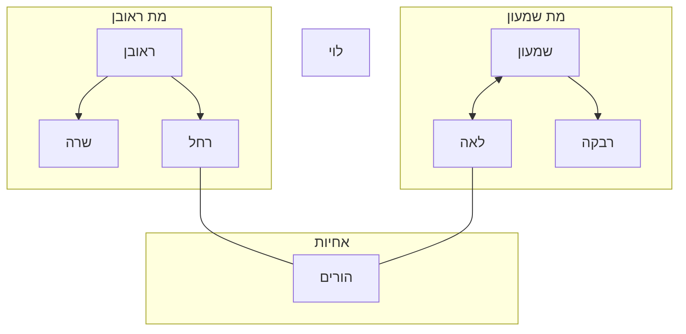
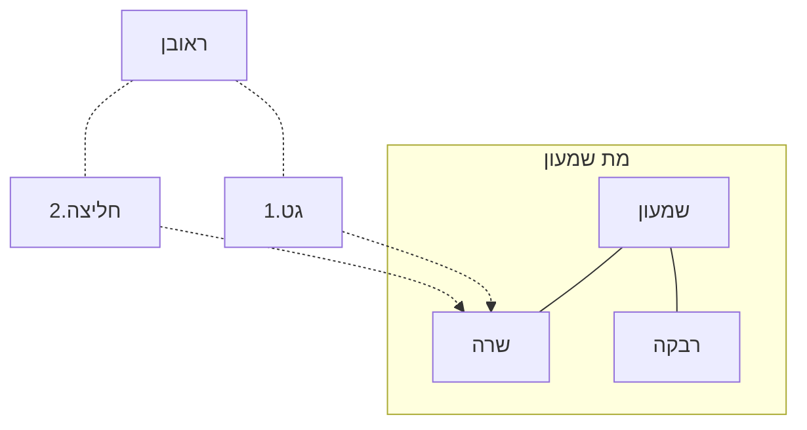
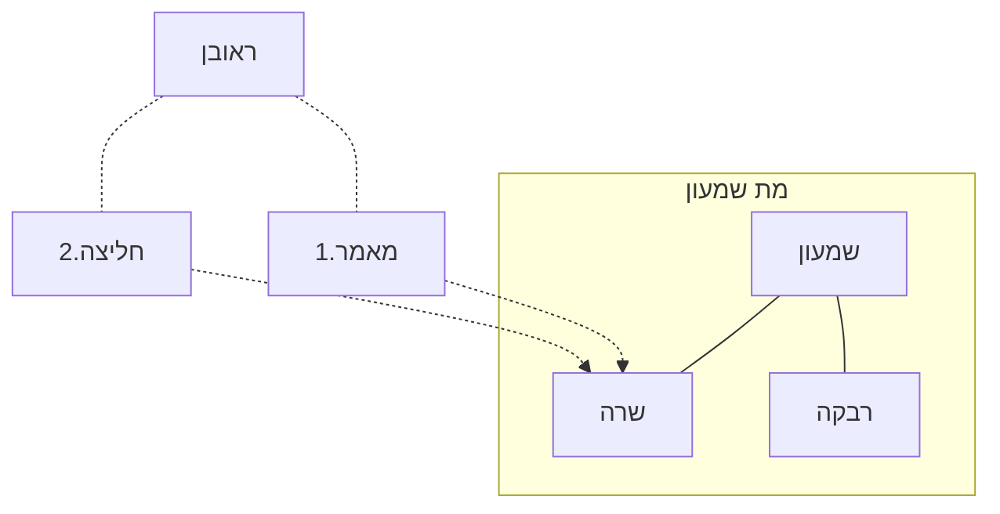

## המימרא של שמואל
מקרה ראשון:
חלץ (לוי) לאחיות לא נפטרו צרות
חלץ לצרות נפטרו אחיות

מקרה שני:
חלץ לבעלת הגט (שרה) לא נפטרה הצרה.
חלץ לצרה נפטרה בעלת הגט

: מקרה שלישי
חלץ לבעלת מאמר (שרה) לא נפטרה צרתה
חלץ לצרה נפטרה בעלת מאמר

### שאלת הגמרא על המקרה הראשון
מה ההבדל? הרי מאחר ורחל ולאה אחיות, אז צרותיהן נחשבות כזקוקות ולכן החליצה שלהם "רעה" גם כן כמו החליצה של האחיות?
#### תרוץ ראשון
שמואל אמר את המימרא אליבא דמאן דאמר אין זיקה ומאחר ואין זיקה, חליצה לצרות תהיה טובה לעומת חליצת האחיות.
#### תרוץ רב אשי
שמואל אכן סבר שיש זיקה, אבל יש זיקה חזקה יותר (אחיות) ויש זיקה חלשה יותר (צרות) ולכן הזיקה החלשה יותר "מנצחת" בעניין החליצה.
### מה מייצר יותר זיקה מאמר או גט
הרי גט לזקוקה מחייב חליצה ומאמר מחייב גט. האם גט מייצר יותר זיקה מחמת שהגט הוא התחלת החליצה או שהמאמר מייצר יותר זיקה מחמת שהמאמר מקרב יותר ל-ביאה ובכך מייצר יותר זיקה.
מהבריתא שראינו שמודה רבן גמליאל במאמר לאחר הגט וכן בגט לאחר מאמר, משמע שאין עדיפות.
## מחלוקת רב ורבי יוחנן
אם ראובן ושמעון היו נשואים לשתי אחיות ומתו ראובן ושמעון (בזה אחר זה). 
לרב: בין אם מתה אשת ראובן ובין אם מתה אשת שמעון, ניתן ללוי לייבם את זו שנותרה.
לרבי יוחנן: רק אם מתה אשת שמעון ניתן לייבם את אשת ראובן מאחר והוחזרה אשת ראובן לחזקת ההיתר שלה ללוי לאור מות אשת שמעון.
### שאלת הגמרא על ר יוחנן
ראינו במשנה לגבי ארבע אחים ששנים מהם היו נשואים לשתי אחיות ומתו האחים. הדין היה שחולצות ולא מתייבמות.
לפי רב לא קשה, כי רב סובר שזה תלוי בחומרת האיסור של אחיות וברגע שאין את איסור האחיות, ניתן לייבם.
אבל לפי ר יוחנן, ברגע שחלצנו לאחת מהן שהתאלמנה מאוחר יותר, השניה תחזור לחזקת ההיתר שלה. אז שייבם את השניה?
ענה ר יוחנן, לא יודע מי שנה את המשנה וזה תמוה לו.
### מדוע לא ענה ר יוחנן
את התשובות הבאות: 
##### חולצות שראינו במשנה
==חולצת==. כלומר רק אחת האחיות חולצת והשניה מתייבמת.
דוחה הגמרא, ==חולצות== קתני.
##### חולצות דעלמא
כלומר, שבכל המקרים ששתי אחיות נופלות לפני שני אחים ==השניות== חולצות ולא מתייבמות.
דוחה הגמרא, כתבנו ==הרי אלו== חולצות ומשמע שמדובר בשתי הנשים שהוזכרו במשנה
##### חליץ לה ברישא
ואולי נאמר שהמשנה מדברת כשאחד האחים חלץ לראשונה בהתחלה ואז גם השניה לא מתייבמת כי לא חזרה לחזקת ההיתר שלה.
דוחה הגמרא, כתבנו במשנה ==חולצות== כלומר, לכתחילה. ולא שיהיה מצב כלשהו של ייבום.
