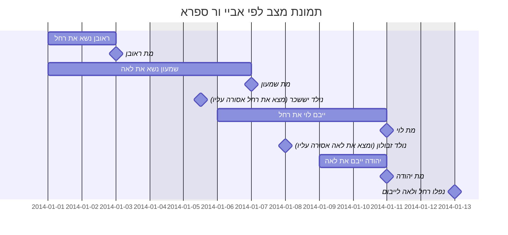

המשך [הדף הקודם](2022-04-03) בשאלות "מדוע לא ענה ר יוחנן" לשאלת ר יוסי בר חנינא
##### מדוע לא ענה שגוזרים
ששתיהן אסורות בייבום שמא יהפכו את הסדר וייבמו גם במקרה האסור? 
דוחה הגמרא, לא ניתן לאמר כן, כי המשנה נקטה לשון ==ולא מתייבמות== כלומר, שאין דין ייבום בכלל.
##### ול"ל גזירה שמא ימות 
האח השני לאחר ייבום האח הראשון, ויבטל מצוות יבמים?
דוחה הגמרא, ר יוחנן לא חש למיתת האח
##### ול"ל שסבר כר אלעזר
שאמר שכיון שנאסרה עליו שעה אחת נאסרה עולמית?
דוחה הגמרא, אי אפשר להעמיד את המשנה כר אלעזר מאחר והוא זה שאמר בסיפא ולא משמע שהרישא לפיו.
##### ול"ל שמתו בבת אחת 
וסבר ר יוחנן כר יוסי הגלילי שאמר שניתן להניח ולצמצם את מיתת האחים לרגע אחד?
דוחה הגמרא, לא סביר שהתנא שלנו סתם כר יוסי הגלילי.
##### ול"ל שלא יודעים מי מהאחים נפל ראשון
דוחה הגמרא, אם כן, לא מסתדר הוראת המשנה "קדמו האחים וכנסו את האחיות ==יוציאו==" מילא הראשון יוציא כי אומרים לו מי התיר לך, אבל השני, למה שיוציא, הרי כנס בהיתר של ספק איסור זיקה?
### שאלה נוספת על ר יוחנן
בציור שאחת מהאחיות אסורה על אחד מהאחים באיסור ערוה - כגון שהיתה חמותו. למה לא ייבם את השניה ואז האח השני יהיה מותר בחמות? עונה הגמרא, אכן בציור כזה אין בעיה, אבל המשנה דיברה בציור שנפלה זאת שאינה חמותו ראשונה לייבום.
### ארבעה אחים 
שהיו שנים מהם נשואים לשתי אחיות ומתו שניהם. אחת מן האחיות היתה אסורה על האח השלישי באיסור עריות, אז רב וכן ר חייא אמרו שבמקרה כזה האח השלישי מייבם את זאת שאינה ערווה עבורו. מאחר והשניה אינה זקוקתו ולכן אין היא מעכבת בידו.
 אז נחלקו האמוראים בפירוש הציור של דברי רב ורב חייא:
 - לפי ר יהודה, מדובר על תשע מכלל העריות שבמשנה (מחמותו ואילך) אבל לא בשש הראשונות (בתו, בת בתו, בת בנו , בת אשתו, בת בתה, בת בנה) ששם ניתן להסביר זאת רק אם המנוח אנס את האשה ולא בנישואין. והמשנה לא מדברת על קרובות מאונסים.
 - לפי אביי, המשנה (לפי רב ורב חייא) דברה גם על בתו מאנוסתו שניתן להסביר כיצד היא תהיה מותרת לזה ואסורה לזה והשניה תהיה להיפך. אבל המשנה לא דברה על אשת אחיו שלא היתה בעולמו. כי רק לפי ר שמעון זה יכול להסתדר בכך שהילד נולד לאחר שכבר האח ייבם את אשת אחיו המת ואז היא לא נאסרת עליו. אבל לפי חכמים לא יהיה ניתן להעמיד כי הם אמרו שגם מקרה כזה אוסר אותה עליו כדין אשת אחיו שלא היה בעולמו. לפי אביי המשנה לא דברה במקרים שנתונים במחלוקת.
אשת אחיו שלא היה בעולמו כבציור הבא:

 - לפי ר ספרא, המשנה כן דברה אפילו באשת אחיו שלא היה בעולמו ורק לפי ר שמעון. 

שאלה הגמרא לפי ר ספרא למה צריך שיהיו ששה אחים, אפשר לוותר על יהודה בציור הזה?
עונה הגמרא, צריך ששה אחים כדי שיוכל להעמיד את זה בצרה (כלומר שהאחים שייבמו את האחיות בציור של ר ספרא, היו נשואים לשתי אחיות אחרות) 
אז איך נעמיד את הציור עם צרות צרה? עונה הגמרא, שנוסיף עוד שני אחים שהיו נשואים לעוד שתי אחיות ומתו ששה משמונת האחים וכבציור לעייל.
## משנה
שלשה אחים שהיו שנים מהם נשואים לשתי אחיות או שהיו שנים מהם נשואים לאשה ובתה\אשה ובת בתה\אשה ובת בנה. הרי אלו חולצות ולא מתייבמות לאח השלישי. כי שתיהן זקוקות לו וכל אחת הינה אחות זקוקתו.
ר שמעון פוטר מן החליצה ומן הייבום(הגמרא תסביר שלמד זאת מ"לא תצרור" שאם נעשו צרות זו לזו לא יהיה לך לקוחין באף אחת)
אם היתה אחת מן האחיות אסורה על האח באיסור ערווה מן התורה, הוא אסור בה ומותר באחותה. 
אם היתה אחת מן האחיות אסורה באיסור מצווה או אסור קדושה, אז שתיהן חולצות ולא מתייבמות.

