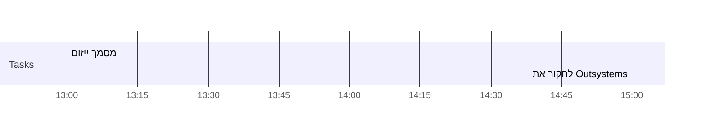

<< [[2021-05-16]] | [[2021-05-23]] >>

> You make a living by what you earn; you make a life by what you give.
> &mdash; <cite>Winston Churchill</cite>
>   

## ToDo
- [ ] 

## ראשון [[2021-05-16]]
- [ ] .

## שני [[2021-05-17]]
- [ ] .

## שלישי [[2021-05-18]]
- [ ] .

## רביעי [[2021-05-19]]
- [ ] .

## חמישי [[2021-05-20]]

- [ ] 13:00 מסמך ייזום
- [x] 15:00 לחקור את Outsystems ✅ 2021-05-24
## Day Planner

-
