[[2021-06-01]]
# תזכיר \ סיכום פגישה בנושא [[מערכת בקשות השאלת ציוד מחשוב]]
[[index]]/[[Open University]]/[[Memos]]

## רקע
פותחה מערכת בעבר לשימושה של דלית והיא כיום עדיין לא בשימוש פעיל. יש לבצע כמה שינויים ע"מ שתענה לצרכים ולתהליכים שנהוגים במחלקת המחשוב ותהליכי השאלת ציוד.
1. הובהר כי יעדי המערכת הינם ניהול תהליך ההשאלה לציוד **שיוצא מחוץ לארגון בלבד** . יתר תהליכי השאלת הציוד הפנימי המיועדים לשמוש במבנה הארגון **לא ישונו ולא יטופלו במסגרת המערכת  הזו **
2. לתהליך שמומש באפליקציית הבקשות שהוקמה כבר, יתווספו כמה שינויים מרכזיים: 
	1.  הבקשה שתוזן ע"י שואל הציוד תיכתב כבקשה כללית (ללא ציון מק"ט וכדו') וההצדקות לקבלת הציוד
	2.   כל בקשה להשאלת ציוד תועבר לאישורה של ליאת בסנו.
	3.  לאחר אישורה של ליאת, דלית תוסיף לבקשת ההשאלה את פרטי העלות, ציוד היקפי נוסף, שם המק"ט.
	4.  במדה והמק"ט אינו במלאי, או שאין מק"ט, תהליך הבקשה ייצא לתהליך ייזום ב[[OP/מסמך ייזום/טופס ייזום | מערכת הייזומים]] החדשה (לכשתקום) באופן מסונכרן.
	5.  דלית תוכל לשנות ידנית, בתוך הבקשה, את הפרטים שיחזרו מן הייזום. 
תרשים התהליך המתוכנן:

```mermaid
graph 
	a(("הזנת בקשה")) --> b{"אישור ליאת"}
	b --> c["מאושר"]
	b --> d["לא מאושר"]
	d --> a
	c --> e{"?קיים במלאי"}
	e --> ex["קיים"]
	ex --> f["הוספת מחיר, מקט וציוד היקפי לבקשה"]
	f --> g["משתמש מאשר את הבקשה ותנאיה במערכת"]
	g --> ed(("מסירת ציוד וסיום"))
	e --> nex["לא קיים במלאי"]
	nex --> h["מבקש נדרש להפוך בקשה לטופס ייזום"]
	h --> i["טיפול במסגרת טופס ייזום"]
	i --> f
```

## נוכחים 
* דיאנה גלברט 
* דלית גרשי
* יקי קמחי

## פעולות
* לינק למערכת יופיע בפורטל המערכות 
* המערכת שפותחה תעבור שיפור נראות ותהליך איפיון חוויית משתמש נפרד
* לתהליך תיווסף אפשרות של העלאת קובץ בשלב החתימה - לצורך תהליך השאלת ציוד למכללות חיצוניות
* התהליך יתחיל בהכנת בקשה כללית ע"י שואל הציוד תוך ציון סעיף של הצדקת הבקשה מתוך רשימה סגורה
* תתאפשר הקמת בקשה ע"י משתמש אחד שמיועדת למשתמש אחר. כך שהמשתמש הראשון יקים את הבקשה (ואת טופס הייזום במדה ונדרש) והשני רק יחתום על הציוד ועל ערכו הכספי.
#### פעולות לביצוע
- [ ] #task דלית תגבש את רשימת סעיפי ההצדקה שברצונה שיופיעו למשתמשים. 📅 2021-06-25
 
המשך מעקב ב: [[2021-06-06]] 

#memo 
#op/memo