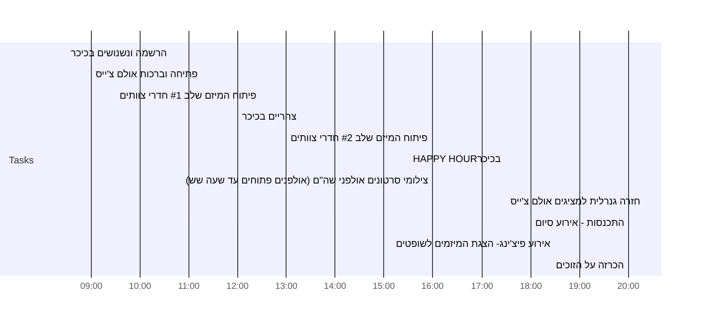

# Daily Tasks: 2021-06-10	

> Vulnerability is not winning or losing; it's having the courage to show up and be seen when we have no control over the outcome.
> &mdash; <cite>Brene Brown</cite>

>   

 [[2021-06-10]]
## מידע בנוגע להאקאתון

![[FW  חומרים מההרצאה של דורין ועוד .msg]]
[[2021-06-03N1 | סיכום מפגש ראשון  (זום) שביצענו בצוות]]

 
## Day Planner


- [ ] 08:30 הרשמה ונשנושים  בכיכר
- [ ] 09:00 פתיחה וברכות   אולם צ'ייס
- [ ] 09:30 פיתוח המיזם שלב #1    חדרי צוותים
- [ ] 12:00 צהריים  בכיכר
- [ ] 13:00 פיתוח המיזם שלב #2   חדרי צוותים
- [ ] 15:30 HAPPY HOURבכיכר
- [ ] 16:00 צילומי סרטונים  אולפני שה"ם  (אולפנים פתוחים עד שעה שש)
- [ ] 17:30 חזרה גנרלית למציגים  אולם צ'ייס
- [ ] 18:00 התכנסות - אירוע סיום
- [ ] 18:30 אירוע פיצ'ינג-  הצגת המיזמים לשופטים
- [ ] 20:00 הכרזה על הזוכים


## משימות

### להשלים היום 

```tasks
not done
due on {{2021-06-10}}
```

### להשלים השבוע

```tasks
not done
due after {{2021-06-06}}
due before {{2021-06-13}}
```


### הושלמו היום

```tasks
done on {{2021-06-10}}
```

## תובנות
המערכת המוצעת הינה עוזר אישי לסטודנט שתשאף להתאמה אישית לצרכי הסטודנט ותגביר את המעורבות של הסטודנט בתהליך הלמידה.

עולמות תוכן:
1. עולם התוכן של פעילות הקורס
2. פעילות תומכת למידה (מלגות, קבוצות ,הווי וכו)
3. פעילות מסלול לימודי וייעוץ לימודי
# pitch
שלום, אני יקי, יועץ מערכות מידע ופיתוח אפליקציות. אב ל-4 ילדים וסטודנט לתואר שני באו"פ. הצורך בפתרון לניהול משאבי הזמן הנדרשים למטלות התואר הוא חיוני עבורי!.  


#dailynote 
#notes/daily
#notes/tasks/daily
#op/notes/daily
#op/hackathon